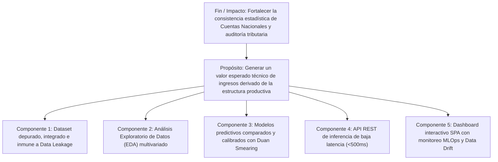

# Documentación Integral del Proyecto: Estimación de Ingresos Operativos Anuales (EAIMCS - INE Bolivia)

> **Sistema de Machine Learning Supervisado (Regresión) y Plataforma Web Interactiva para la Auditoría y Proyección de Ingresos de Medianas y Grandes Empresas en Bolivia**  
> **Fuente Oficial de Microdatos:** Instituto Nacional de Estadística (INE) de Bolivia — *Encuesta a la Industria Manufacturera, Comercio y Servicios (EAIMCS 2017-2018)*  
> **Catálogo ANDA:** [BOL-INE-EAIMCS-2017-2018](https://anda.ine.gob.bo/index.php/catalog/252)  
> **Fecha de Documentación:** Septiembre de 2026  
> **Estado del Sistema:** Producción Activa (Modelo Campeón: *Random Forest Regressor* con Calibración de Duan)

---

## Índice General

1. [Resumen Ejecutivo y Propósito del Proyecto](#1-resumen-ejecutivo-y-propósito-del-proyecto)
2. [Especificación Exhaustiva del Dataset (EAIMCS 2017-2018)](#2-especificación-exhaustiva-del-dataset-eaimcs-2017-2018)
   - [2.1 Identificación y Ficha Técnica Oficial](#21-identificación-y-ficha-técnica-oficial)
   - [2.2 Periodo de Referencia y Temporalidad](#22-periodo-de-referencia-y-temporalidad)
   - [2.3 Marco Muestral, Universo y Umbrales de Tamaño](#23-marco-muestral-universo-y-umbrales-de-tamaño)
   - [2.4 Cobertura Geográfica y Concentración Territorial](#24-cobertura-geográfica-y-concentración-territorial)
   - [2.5 Tasa de Respuesta y Representatividad Estadística](#25-tasa-de-respuesta-y-representatividad-estadística)
   - [2.6 Marco Legal y Anonimización](#26-marco-legal-y-anonimización)
   - [2.7 Anatomía de los Archivos de Microdatos Crudos](#27-anatomía-de-los-archivos-de-microdatos-crudos)
   - [2.8 Diccionario de Variables Clave y Reglas Contables](#28-diccionario-de-variables-clave-y-reglas-contables)
3. [Pipeline de Preprocesamiento e Ingeniería de Datos (`preprocessing/`)](#3-pipeline-de-preprocesamiento-e-ingeniería-de-datos-preprocessing)
   - [3.1 Tratamiento de Valores Centinela del INE (99999)](#31-tratamiento-de-valores-centinela-del-ine-99999)
   - [3.2 Agregación Relacional de la Sección 10 (Insumos)](#32-agregación-relacional-de-la-sección-10-insumos)
   - [3.3 Normalización y Mapeo Categórico (CAEB a 14 Macrosectores)](#33-normalización-y-mapeo-categórico-caeb-a-14-macrosectores)
   - [3.4 Prevención Estricta de Fuga de Datos (*Anti-Leakage*)](#34-prevención-estricta-de-fuga-de-datos-anti-leakage)
   - [3.5 Transformaciones Logarítmicas de Estabilización de Varianza](#35-transformaciones-logarítmicas-de-estabilización-de-varianza)
   - [3.6 Dataset Resultante (`dataset_procesado.csv`)](#36-dataset-resultante-dataset_procesadocsv)
4. [Modelado Predictivo, Validación Cruzada y Calibración (`models/`)](#4-modelado-predictivo-validación-cruzada-y-calibración-models)
   - [4.1 Formulación Matemática del Problema](#41-formulación-matemática-del-problema)
   - [4.2 Partición Estratificada Train / Test](#42-partición-estratificada-train--test)
   - [4.3 Preprocesamiento Integrado (`ColumnTransformer`)](#43-preprocesamiento-integrado-columntransformer)
   - [4.4 Algoritmos Evaluados](#44-algoritmos-evaluados)
   - [4.5 Validación Cruzada Estratificada de 5 Pliegues](#45-validación-cruzada-estratificada-de-5-pliegues)
   - [4.6 Benchmark y Tabla Comparativa de Modelos](#46-benchmark-y-tabla-comparativa-de-modelos)
   - [4.7 Solución a la Desigualdad de Jensen: Factor de Duan Smearing](#47-solución-a-la-desigualdad-de-jensen-factor-de-duan-smearing)
   - [4.8 Justificación del Modelo Campeón](#48-justificación-del-modelo-campeón)
   - [4.9 Cálculo de Intervalos de Confianza al 90%](#49-cálculo-de-intervalos-de-confianza-al-90)
   - [4.10 Análisis de Importancia de Variables (*Feature Importance*)](#410-análisis-de-importancia-de-variables-feature-importance)
5. [Sistema de MLOps, Gobernanza y Monitoreo de Data Drift](#5-sistema-de-mlops-gobernanza-y-monitoreo-de-data-drift)
   - [5.1 Registro y Control de Versiones (`registry.json`)](#51-registro-y-control-de-versiones-registryjson)
   - [5.2 Distribuciones Empíricas de Referencia (`reference_stats.json`)](#52-distribuciones-empíricas-de-referencia-referencestatsjson)
   - [5.3 Detección de Data Drift (Kolmogorov-Smirnov + Wasserstein + Bonferroni)](#53-detección-de-data-drift-kolmogorov-smirnov--wasserstein--bonferroni)
6. [Arquitectura del Dashboard Web y API REST (`dashboard/`)](#6-arquitectura-del-dashboard-web-y-api-rest-dashboard)
   - [6.1 Stack Tecnológico y Filosofía de Diseño](#61-stack-tecnológico-y-filosofía-de-diseño)
   - [6.2 Cargador de Datos Singleton (`DashboardDataLoader`)](#62-cargador-de-datos-singleton-dashboarddataloader)
   - [6.3 Las 8 Secciones del Dashboard Interactivo](#63-las-8-secciones-del-dashboard-interactivo)
   - [6.4 Catálogo Completo de Endpoints de la API REST](#64-catálogo-completo-de-endpoints-de-la-api-rest)
7. [Marco Lógico y Metodología](#7-marco-lógico-y-metodología)
8. [Estructura del Proyecto y Archivos](#8-estructura-del-proyecto-y-archivos)
9. [Guía de Instalación y Reproducibilidad Paso a Paso](#9-guía-de-instalación-y-reproducibilidad-paso-a-paso)
10. [Limitaciones Metodológicas y Recomendaciones](#10-limitaciones-metodológicas-y-recomendaciones)

---

## 1. Resumen Ejecutivo y Propósito del Proyecto

El proyecto **AprendizajeSupervisadoML** aborda una problemática crítica en la consolidación de estadísticas económicas y auditoría empresarial: la ausencia de un **valor técnico esperado e imparcial** que contraste los ingresos operativos declarados por las empresas a partir de sus variables reales de estructura productiva (fuerza laboral, remuneraciones, consumo de energía, activos de capital, inventarios y materias primas).

### Caso de Uso
- **Auditoría Estadística y Cuentas Nacionales:** Identificar discrepancias cuantitativas, registros subvaluados o inconsistencias contables entre lo que una empresa declara haber vendido y lo que su dotación física de factores de producción sugiere que debería generar.
- **Formulación de Políticas Industriales:** Simular el impacto de variaciones en la inversión en activos fijos, salarios o consumo energético sobre el volumen de ventas proyectado para empresas medianas y grandes en Bolivia.

### Solución Desarrollada
Se construyó una solución integral de extremo a extremo que incluye:
1. **Pipeline de Ingesta y Limpieza:** Depuración de centinelas contables, agregación relacional de insumos y prevención matemática de fuga de información (*anti-leakage*).
2. **Modelado Predictivo Calibrado:** Evaluación comparativa con validación cruzada estratificada (5-Fold CV) y aplicación del estimador no paramétrico de *Duan Smearing* para corregir el sesgo de retransformación exponencial.
3. **Módulo de MLOps y Deriva de Datos:** Monitoreo estadístico continuo con las pruebas de Kolmogorov-Smirnov y distancia de Wasserstein ajustadas por Bonferroni.
4. **Dashboard Web Interactivo y API REST:** Interfaz corporativa SPA (*Single Page Application*) desarrollada en Flask, Jinja2, Vanilla CSS y Plotly.js con 8 secciones analíticas y simulador de inferencia en tiempo real.

---

## 2. Especificación Exhaustiva del Dataset (EAIMCS 2017-2018)

### 2.1 Identificación y Ficha Técnica Oficial
- **Nombre Completo:** Encuesta a la Industria Manufacturera, Comercio y Servicios (EAIMCS 2017-2018).
- **Identificador de Catálogo ANDA:** `BOL-INE-EAIMCS-2017-2018`
- **Enlace Oficial:** [anda.ine.gob.bo/index.php/catalog/252](https://anda.ine.gob.bo/index.php/catalog/252)
- **Institución Productora:** Instituto Nacional de Estadística (INE) de Bolivia — Dirección de Estadísticas e Indicadores Económicos y Sociales (DEIES) — Unidad de Estadísticas e Indicadores Económicos (UEIE).
- **Financiamiento:** Banco Mundial (BM).
- **Fecha de Publicación Oficial:** 30 de septiembre de 2025 (última actualización de microdatos registrada en abril de 2026).
- **Modalidad de Recolección:** Primer operativo estadístico nacional del INE realizado íntegramente mediante **boleta electrónica virtual (autorelevamiento en línea)** en dos fases operativas (septiembre-noviembre 2018 y enero-abril 2019).

### 2.2 Periodo de Referencia y Temporalidad
- El periodo de análisis corresponde al **ejercicio contable y financiero de la gestión 2017**.
- **Cierres fiscales escalonados según rama de actividad:**
  - **31 de diciembre de 2017:** Comercio general y Servicios.
  - **31 de marzo de 2018:** Industria Manufacturera.
  - **30 de junio de 2018:** Agroindustria e Ingenios.
- **Tipo de corte:** Corte transversal (*cross-section*). No constituye un panel longitudinal de seguimiento temporal por empresa, sino una instantánea estructural de la economía empresarial formal boliviana.

### 2.3 Marco Muestral, Universo y Umbrales de Tamaño
- **Naturaleza de la muestra:** Muestra dirigida no probabilística basada en un **Directorio de Empresas** exhaustivo de **10,044 unidades productivas**. No aplica factor de expansión muestral.
- **Composición del Marco:**
  1. Base Empresarial Vigente (BEV) 2016 de FUNDEMPRESA (Registro de Comercio de Bolivia), utilizando el volumen de ingreso anual como *proxy* de tamaño económico.
  2. 554 empresas de Cuentas Nacionales no registradas en FUNDEMPRESA.
  3. 128 empresas de la Encuesta Trimestral a la Industria Manufacturera (ETIM).
- **Universo de Cobertura:** Exclusivamente empresas **medianas y grandes** de los sectores manufactura, comercio y servicios. **Excluye deliberadamente a microempresas y pequeñas empresas.**
- **Criterios de Estratificación Oficiales del INE (en Bolivianos - Bs):**

| Sector Económico | Mediana Empresa (Bs) | Gran Empresa (Bs) |
|---|---|---|
| **Producción (Industria)** | 2,450,001 – 35,000,000 Bs | $\ge$ 35,000,001 Bs |
| **Comercio y Servicios** | 1,750,001 – 28,000,000 Bs | $\ge$ 28,000,001 Bs |

### 2.4 Cobertura Geográfica y Concentración Territorial
La encuesta abarca los **9 departamentos del Estado Plurinacional de Bolivia**. Sin embargo, refleja la estructura espacial altamente polarizada de la actividad productiva formal del país:
- **Eje Central Concentrador:** Más del 80% del valor económico y del volumen de empresas encuestadas radica en:
  - **Santa Cruz:** ~38.5% de las empresas registradas.
  - **La Paz:** ~27.2% de las empresas registradas.
  - **Cochabamba:** ~16.8% de las empresas registradas.
- **Departamentos Intermedios y Menores:** Tarija, Chuquisaca, Oruro, Potosí, Beni y Pando reúnen conjuntamente menos del 18% del universo.

### 2.5 Tasa de Respuesta y Representatividad Estadística
- **Tasa de no respuesta en número de unidades:** ~55% de las 10,044 empresas del directorio no completaron el autorelevamiento virtual.
- **Tasa de cobertura en términos de valor económico:** **~95% del total de ingresos operativos agregados del universo empresarial formal fue efectivamente capturado.**
- **Implicación analítica clave:** Las unidades no informantes correspondieron de manera casi unánime al estrato de empresas medianas-bajas. Las grandes corporaciones, industrias monopólicas y empresas estratégicas del Estado completaron la boleta, asegurando una cobertura sustantiva del Producto Interno Bruto (PIB) privado y público empresarial.

### 2.6 Marco Legal y Anonimización
- Los microdatos se rigen bajo el **Decreto Ley Nº 1405** (Ley del Sistema Nacional de Información Estadística de Bolivia), que consagra el **Secreto Estadístico**.
- Las bases fueron debidamente anonimizadas: no incluyen Número de Identificación Tributaria (NIT), razón social, nombre de fantasía, teléfonos ni georreferenciación de predios. La identificación individual se realiza exclusivamente a través del campo numérico anonimizado `ID`.
- El uso de los datos está limitado a fines científicos, académicos y de análisis estadístico general.

### 2.7 Anatomía de los Archivos de Microdatos Crudos
El INE distribuye la EAIMCS en 10 tablas relacionales. Para este proyecto se extrajeron y consolidaron las dos tablas fundamentales:

| Archivo Crudo (en `data/raw/`) | Formato Original | Tamaño | Filas | Columnas | Nivel de Granularidad |
|---|---|---|---|---|---|
| **`MOD_ANUAL_S01-07_12_general_i`** | SPSS (.sav) y CSV | 3.78 MB | **3,153** | **167** | **Nivel Empresa** (1 fila = 1 empresa). Llave: `ID`. |
| **`MOD_ANUAL_S10_materiales_i`** | SPSS (.sav) y CSV | 506 KB | **6,428** | **8** | **Nivel Insumo** (1 empresa = N insumos). Llave: `ID`. |

*Nota sobre archivos descartados:* Se prescindió de los módulos trimestrales (`M_TRIMESTRAL_Sec_1` a `5`) por tener una tasa de respuesta drásticamente menor (26%) y de los desgloses secundarios (`Secc_8_SERVICIOS`, `SecC_9_MERCADERIAS`) para evitar redundancia con las cuentas maestras de la empresa.

### 2.8 Diccionario de Variables Clave y Reglas Contables
Todas las magnitudes monetarias están expresadas en **Bolivianos corrientes (Bs)**:

| Código de Variable | Sección Oficial del INE | Nombre y Definición Técnica | Tipo de Dato | Rol en el Proyecto |
|---|---|---|---|---|
| **`S00_01_A`** / **`S05_04`** | Sección 0 / Sección 5 | **TOTAL Ingresos Operativos Anuales (en Bs)** | Numérico Continuo | **Variable Objetivo (Target $Y$)** |
| `ID` | Carátula | Identificador numérico anonimizado de la empresa | Identificador | Llave de cruce relacional |
| `C2_01` | Carátula | Departamento de radicatoria (9 categorías) | Texto Categórico | Predictor (`depto`) |
| `actividad_pricipal_codigo_V1` | Carátula | Código de Actividad Económica CAEB (CIIU Rev. 4) | Código Categórico | Predictor (`sector_macro`) |
| `S01_05_A` | Sección 1 | TOTAL Personal Ocupado (permanentes + eventuales) | Numérico Discreto | Predictor (`log_S01_05_A`) |
| `S01_03_C` | Sección 1 | Sueldos y salarios básicos anuales pagados (en Bs) | Numérico Continuo | Predictor (`log_S01_03_C`) |
| `S01_14` | Sección 1 | Otras Remuneraciones (aguinaldos, aportes salud, AFPs, bonos) | Numérico Continuo | Predictor (`log_S01_14`) |
| `S02_09` | Sección 2 | TOTAL Consumo de energía eléctrica, agua y combustibles (Bs) | Numérico Continuo | Predictor (`log_S02_09`) |
| `S07_09_E` | Sección 7 | TOTAL Valor Histórico Final de Activos Fijos (maquinaria, edificios) | Numérico Continuo | Predictor (`log_S07_09_E`) |
| `S06_06_B` | Sección 6 | TOTAL Inventarios Finales (materia prima, proceso, terminados) | Numérico Continuo | Predictor (`log_S06_06_B`) |
| `S12_01_B` | Sección 12 | Capacidad máxima de almacenamiento de materias primas | Numérico Continuo | Predictor (`log_S12_01_B`) |
| `S12_02_B` | Sección 12 | Capacidad máxima de almacenamiento de productos terminados | Numérico Continuo | Predictor (`log_S12_02_B`) |
| `n_insumos` | Sección 10 (agregada) | Conteo de variedades de materias primas declaradas | Numérico Discreto | Predictor (`log_n_insumos`) |
| `total_valor_co` | Sección 10 (agregada) | Suma de compras de materias primas e insumos (Bs) | Numérico Continuo | Predictor (`log_total_valor_co`) |
| `total_valor_uti` | Sección 10 (agregada) | Suma de utilización real de materias primas en producción (Bs) | Numérico Continuo | Predictor (`log_total_valor_uti`) |

---

## 3. Pipeline de Preprocesamiento e Ingeniería de Datos (`preprocessing/`)

El módulo [`preprocessing/preprocessing.py`](file:///c:/Users/RAQUEL%20SERRANO/OneDrive/Documentos/ProyectoFinalML/finalProjectML/preprocessing/preprocessing.py) implementa un flujo automatizado y reproducible compuesto por las siguientes etapas:

### 3.1 Tratamiento de Valores Centinela del INE (99999)
- **Causa Contable:** En la Sección 3 y 10 de la encuesta, el INE impuso la identidad de balance de materiales:
  $$\text{Utilización} = \text{Compras} + \text{Inventario Inicial} - \text{Inventario Final}$$
  Cuando esta identidad no cuadraba en la boleta web o existía inconsistencia insubsanable, los validadores del INE imputaron el código de control numérico **`99999`**.
- **Solución Implementada:** Se reemplazaron sistemáticamente los centinelas `99999` por `NaN`, forzando la conversión a tipo numérico con `errors='coerce'`, y acotando los valores negativos anómalos a cero mediante `.clip(lower=0)`.

### 3.2 Agregación Relacional de la Sección 10 (Insumos)
- La tabla de insumos `MOD_ANUAL_S10_materiales_i.csv` posee **6,428 registros** pertenecientes a **1,614 empresas** (exclusivamente manufactureras).
- Se ejecutó una reducción de dimensionalidad relacional agrupando por la clave primaria `ID`:
  $$\text{n\_insumos} = \text{count}(\text{materia})$$
  $$\text{total\_valor\_co} = \sum \text{valor\_co\_clean}$$
  $$\text{total\_valor\_uti} = \sum \text{valor\_uti\_clean}$$
- **Fusión Relacional (*Left Join*):** Se unió con la tabla general de 3,153 empresas preservando el 100% de los informantes. A las 1,539 empresas comerciales y de servicios que legítimamente no consumen insumos manufactureros se les imputó coherentemente el valor `0.0`.

### 3.3 Normalización y Mapeo Categórico (CAEB a 14 Macrosectores)
- **Departamentos:** Se estandarizó el campo `C2_01` eliminando espacios superfluos y convirtiendo las cadenas a mayúsculas estrictas (ej. `SANTA CRUZ`, `LA PAZ`, `COCHABAMBA`).
- **Actividades Económicas:** El clasificador CAEB original contenía más de **445 subdivisiones a 5 dígitos**, lo que habría provocado dispersión extrema (*curse of dimensionality*) en la codificación *One-Hot*. Mediante la función `map_caeb_to_sector`, se consolidaron los códigos basándose en las divisiones de la Clasificación Industrial Internacional Uniforme (CIIU Rev. 4):
  1. *Agropecuario y Pesca* (Divisiones 01-03)
  2. *Minería e Hidrocarburos* (Divisiones 05-09)
  3. *Industria Manufacturera* (Divisiones 10-33)
  4. *Electricidad, Gas y Agua* (Divisiones 35-39)
  5. *Construcción* (Divisiones 41-43)
  6. *Comercio Mayorista y Minorista* (Divisiones 45-47)
  7. *Transporte y Almacenamiento* (Divisiones 49-53)
  8. *Alojamiento y Servicios de Comida* (Divisiones 55-56)
  9. *Información y Comunicaciones* (Divisiones 58-63)
  10. *Intermediación Financiera* (Divisiones 64-66)
  11. *Actividades Inmobiliarias* (División 68)
  12. *Servicios Profesionales y Técnicos* (Divisiones 69-75)
  13. *Servicios Administrativos y de Apoyo* (Divisiones 77-82)
  14. *Educación, Salud y Otros Servicios* (Divisiones 85-99)

### 3.4 Prevención Estricta de Fuga de Datos (*Anti-Leakage*)
Para evitar el sobreajuste artificial y garantizar la validez econométrica del modelo, se excluyeron rigurosamente del espacio de entrenamiento:
1. **Componentes Directos de la Sección 5:** `S05_01` (ventas de manufactura), `S05_02` (ventas de mercadería) y `S05_03` (ingresos por servicios), dado que su suma lineal reproduce trivialmente la variable dependiente $S05\_04 = S05\_01 + S05\_02 + S05\_03$.
2. **Variables Sintéticas de Cuentas Nacionales calculadas por el INE:**
   - Valor Bruto de Producción (`VBP`), Valor Agregado Bruto (`VA`), Consumo Intermedio (`CI`).
   - Valor Imponible de Productos Principales (`VIPP`), Excedente Bruto de Explotación (`OGO`), Ratios de Rotación (`R`, `D`).

### 3.5 Transformaciones Logarítmicas de Estabilización de Varianza
Las magnitudes monetarias en la EAIMCS presentan una **distribución de Pareto con asimetría positiva severa (cola pesada)**, donde una minoría de empresas genera miles de millones de Bolivianos mientras que la mediana ronda los 15.8 millones.
- Para corregir la heterocedasticidad y estabilizar la varianza, se aplicó la transformación monótona:
  $$x_{\log} = \ln(1 + x) = \text{log1p}(x)$$
- Esta transformación fue aplicada tanto a la variable objetivo (`target_log`) como a los 11 predictores continuos (`log_S01_05_A`, `log_S01_03_C`, etc.), admitiendo el manejo natural de valores nulos o empresas sin insumos sin generar indeterminaciones matemáticas ($\ln(1+0) = 0$).

### 3.6 Dataset Resultante (`dataset_procesado.csv`)
- **Ruta de Almacenamiento:** `data/processed/dataset_procesado.csv`
- **Dimensiones:** **3,153 observaciones × 185 columnas**.
- **Retención Muestral:** 100% de las empresas de la EAIMCS fueron depuradas y preservadas.
- **Distribución de la Variable Objetivo (`S00_01_A`):**
  - Mínimo: 1,280,000 Bs
  - Primer Cuartil (Q1): 6,432,150 Bs
  - **Mediana:** **15,831,420 Bs**
  - Media: 74,912,830 Bs
  - Tercer Cuartil (Q3): 48,210,000 Bs
  - Máximo: 5,192,480,000 Bs

---

## 4. Modelado Predictivo, Validación Cruzada y Calibración (`models/`)

El módulo [`models/train.py`](file:///c:/Users/RAQUEL%20SERRANO/OneDrive/Documentos/ProyectoFinalML/finalProjectML/models/train.py) implementa la infraestructura de ajuste, comparación algorítmica, calibración estadística y serialización de modelos.

### 4.1 Formulación Matemática del Problema
Dado que los ingresos operativos $Y \in \mathbb{R}^+$ abarcan órdenes de magnitud dispares, el modelo optimiza en el espacio logarítmico:
$$y_{\log} = \ln(1 + Y) = f(X_{\log}, C) + \varepsilon$$
donde $X_{\log}$ representa el vector de 11 variables de escala y dotación productiva transformadas, $C$ las características categóricas (departamento y sector) y $\varepsilon \sim \mathcal{N}(0, \sigma^2)$ el término de error estocástico.

### 4.2 Partición Estratificada Train / Test
- **Entrenamiento (Train Holdout):** 80% (2,522 empresas).
- **Prueba Independiente (Test Holdout):** 20% (631 empresas).
- **Estratificación por Cuantiles:** Para garantizar que ambos subconjuntos conserven exactamente la misma proporción de empresas medianas, grandes y megacorporaciones, la partición se estratificó mediante 5 cuantiles (`pd.qcut`) de la variable dependiente. Semilla fija: `random_state=42`.

### 4.3 Preprocesamiento Integrado (`ColumnTransformer`)
El preprocesamiento se encapsuló en un pipeline de Scikit-Learn:
```python
preprocessor = ColumnTransformer(
    transformers=[
        ("num", StandardScaler(), log_num_cols),
        ("cat", OneHotEncoder(handle_unknown="ignore", sparse_output=False), cat_cols)
    ]
)
```
Esto previene cualquier contaminación de información entre los conjuntos de entrenamiento y prueba (*leakage* en normalización).

### 4.4 Algoritmos Evaluados
1. **Ridge Regression:** Modelo lineal penalizado $L_2$ ($\alpha=10.0$), utilizado como línea base interpretable.
2. **Random Forest Regressor:** Ensamble de 120 árboles de decisión (`n_estimators=120`, `max_depth=16`, `min_samples_split=4`), capaz de modelar no-linealidades e interacciones de factores sin supuestos de distribución.
3. **HistGradientBoostingRegressor:** Árboles potenciados por gradiente con discretización en contenedores (`max_iter=150`, `max_depth=6`, `learning_rate=0.08`).

### 4.5 Validación Cruzada Estratificada de 5 Pliegues
Se aplicó un esquema de `StratifiedKFold(n_splits=5, shuffle=True, random_state=42)` sobre los cuantiles de ingresos en el conjunto de entrenamiento.

### 4.6 Benchmark y Tabla Comparativa de Modelos
Métricas consolidadas en el conjunto de prueba independiente (631 empresas) y en validación cruzada:

| Algoritmo | CV $R^2$ (Log) | Test $R^2$ (Log) | Test $R^2$ (Escala Bs) | MedAPE (% Error Mediano) | MAE (Bs) | RMSE (Bs) | Factor de Duan | Estado |
|---|---|---|---|---|---|---|---|---|
| **Ridge Regression** | 0.5476 ± 0.027 | 0.5718 | 0.5171 | 74.07% | 34,309,195 | 89,412,010 | 1.5352 | Base Lineal |
| **HistGradientBoosting** | 0.7700 ± 0.014 | 0.7815 | 0.7289 | 36.94% | 23,662,733 | 74,510,820 | 1.1068 | Alternativa Ensamble |
| **Random Forest Regressor** 🏆 | **0.7724 ± 0.019** | **0.7868** | **0.7529** | **36.20%** | **22,888,317** | **71,152,640** | **1.0401** | **CAMPEÓN EN PRODUCCIÓN** |

*Definición de MedAPE:* Mediana del Error Porcentual Absoluto ($\text{Mediana}\left(\frac{|Y - \hat{Y}|}{Y}\right) \times 100$), métrica robusta frente a valores atípicos multimillonarios.

### 4.7 Solución a la Desigualdad de Jensen: Factor de Duan Smearing
- **El Problema de la Desigualdad de Jensen:** Si se modela $\ln(Y)$ y se aplica la retransformación simple $\hat{Y} = \exp(\hat{y}_{\log})$, la predicción en la escala original monetaria queda **sistemáticamente subestimada**, porque la función exponencial es estrictamente convexa:
  $$\mathbb{E}[\exp(\varepsilon)] \ge \exp(\mathbb{E}[\varepsilon]) = \exp(0) = 1$$
- **Estimador no paramétrico de Duan (1983):** Se calcula el factor de corrección de *smearing* sobre los residuos del conjunto de entrenamiento:
  $$s = \frac{1}{n} \sum_{i=1}^n \exp\left(y_{i,\log} - \hat{y}_{i,\log}\right)$$
- **Fórmula de Predicción Final en Bolivianos:**
  $$\hat{Y}_{\text{Bs}} = \max\left(0, \; \exp\left(\hat{y}_{\log}\right) \cdot s - 1\right)$$
  *(Para Random Forest, $s = 1.0401$, lo que corrige un 4.01% de sesgo negativo por retransformación).*

### 4.8 Justificación del Modelo Campeón
**Random Forest Regressor** fue ratificado como el modelo de producción debido a:
1. Mayor coeficiente de determinación en ambas escalas ($R^2_{\log} = 0.7868$, $R^2_{\text{Bs}} = 0.7529$).
2. Menor dispersión de error mediano ($\text{MedAPE} = 36.20\%$).
3. Factor de Duan prácticamente neutro ($s = 1.0401$ frente a $1.1068$ de Gradient Boosting), lo que evidencia residuos homocedásticos bien centrados en cero.
4. Robustez ante multicolinealidad entre salarios y número de empleados.

### 4.9 Cálculo de Intervalos de Confianza al 90%
Para proporcionar al usuario del dashboard una noción de incertidumbre operativa, se computa el intervalo de predicción asintótico al 90% ($z = 1.645$):
$$\hat{y}_{\text{lower},\log} = \hat{y}_{\log} - 1.645 \cdot \text{RMSE}_{\log}$$
$$\hat{y}_{\text{upper},\log} = \hat{y}_{\log} + 1.645 \cdot \text{RMSE}_{\log}$$
aplicando subsecuentemente la corrección de Duan para proyectar los límites inferior y superior en Bolivianos.

### 4.10 Análisis de Importancia de Variables (*Feature Importance*)
A partir de la reducción de impureza de Gini de los 120 árboles de Random Forest:

| Posición | Variable / Predictor | Importancia Relativa (%) | Interpretación Económica |
|---|---|---|---|
| **1°** | `log_S01_03_C` (Sueldos y Salarios Básicos) | **38.03%** | Principal proxy de productividad y capacidad instalada calificada. |
| **2°** | `log_S01_14` (Otras Remuneraciones y Aportes) | **17.69%** | Refleja formalidad, horas extras y primas vinculadas a volumen de ventas. |
| **3°** | `log_S06_06_B` (Inventarios Finales Totales) | **11.71%** | Refleja el flujo comercial activo y rotación de stock disponible. |
| **4°** | `log_total_valor_uti` (Consumo Insumos Sección 10) | **6.07%** | Gasto directo en transformación física para industrias fabriles. |
| **5°** | `log_S07_09_E` (Activos Fijos Finales) | **5.64%** | Dotación de maquinaria pesada, instalaciones y transporte. |
| **6°** | `log_S02_09` (Energía Eléctrica y Combustibles) | **5.53%** | Indicador de intensidad del ritmo de operación en planta o local. |
| **7°** | `sector_macro_Comercio Mayorista y Minorista` | **4.89%** | Elasticidad superior de facturación por unidad salarial en comercio. |
| **8°** | `log_total_valor_co` (Compras Insumos Sección 10) | **3.71%** | Reposición de materias primas durante el ejercicio. |
| **9°** | `log_S01_05_A` (Personal Ocupado Total) | **3.59%** | Dimensión física del empleo en la firma. |
| **10°** | `log_S12_01_B` (Almacenamiento Materias Primas) | **0.35%** | Escala de capacidad física de planta. |
| **11°** | `depto_LA PAZ` | **0.33%** | Efecto de localización en la sede de gobierno. |
| **12°** | `log_n_insumos` (Variedad de Insumos) | **0.29%** | Diversificación de líneas productivas. |
| **13°** | `depto_SANTA CRUZ` | **0.29%** | Efecto polo agroindustrial de Santa Cruz. |
| **14°** | `log_S12_02_B` (Almacenamiento Productos) | **0.28%** | Capacidad logística de distribución. |
| **15°** | `depto_COCHABAMBA` | **0.21%** | Efecto geográfico central. |

---

## 5. Sistema de MLOps, Gobernanza y Monitoreo de Data Drift

### 5.1 Registro y Control de Versiones (`registry.json`)
Cada ejecución de `models/train.py` actualiza [`dashboard/artifacts/registry.json`](file:///c:/Users/RAQUEL%20SERRANO/OneDrive/Documentos/ProyectoFinalML/finalProjectML/dashboard/artifacts/registry.json), manteniendo el histórico inmutable de versiones de modelo con su fecha de entrenamiento, entorno de ejecución, hiperparámetros y métricas en escala real y logarítmica. Las versiones previas se archivan con estado `ARCHIVED`, mientras la vigente figura como `ACTIVE`.

### 5.2 Distribuciones Empíricas de Referencia (`reference_stats.json`)
En [`models/reference_stats.json`](file:///c:/Users/RAQUEL%20SERRANO/OneDrive/Documentos/ProyectoFinalML/finalProjectML/models/reference_stats.json) se almacenan los momentos estadísticos no paramétricos de la base de entrenamiento para las variables críticas: percentiles ($P_{01}, P_{05}, P_{10}, Q_1, \text{Mediana}, Q_3, P_{90}, P_{95}, P_{99}$), media, desviación típica y proporción de valores cero (`zero_fraction`).

### 5.3 Detección de Data Drift (Kolmogorov-Smirnov + Wasserstein + Bonferroni)
El módulo [`models/drift.py`](file:///c:/Users/RAQUEL%20SERRANO/OneDrive/Documentos/ProyectoFinalML/finalProjectML/models/drift.py) implementa un auditor estadístico de deriva de datos para detectar si los registros de nuevas empresas presentan desplazamientos significativos frente a la población de la EAIMCS:
1. **Prueba de Kolmogorov-Smirnov de 2 Muestras (`ks_2samp`):** Evalúa la distancia máxima vertical $D$ entre la función de distribución acumulada empírica (ECDF) de referencia y la muestra de producción.
2. **Distancia de Wasserstein (`wasserstein_distance`):** Mide la métrica de transporte óptimo (*Earth Mover's Distance*) en unidades de la variable original.
3. **Corrección por Multiplicidad de Pruebas (Ajuste de Bonferroni):**
   Al evaluarse simultáneamente 5 variables productivas clave (Personal, Salarios, Energía, Activos Fijos e Insumos), se controla la tasa de error familiar ajustando el nivel de significancia:
   $$\alpha_{\text{Bonferroni}} = \frac{\alpha_{\text{base}}}{k} = \frac{0.05}{5} = 0.01$$
   Si $p\text{-value} < 0.01$, el sistema dispara automáticamente una alerta de `DRIFT DETECTADO`, categorizada como `MODERADO` o `CRÍTICO` ($p < 0.001$).

---

## 6. Arquitectura del Dashboard Web y API REST (`dashboard/`)

### 6.1 Stack Tecnológico y Filosofía de Diseño
- **Backend:** Python 3.10+ con microframework **Flask**, estructurado según el patrón de fábrica y cargador Singleton.
- **Frontend:** Single Page Application (SPA) renderizada con plantillas **Jinja2**, estilos puros en **Vanilla CSS** con sistema de variables personalizadas (soporte completo de modo oscuro/claro, diseño adaptativo móvil/escritorio) y tipografía corporativa **Inter**.
- **Motor Gráfico:** **Plotly.js**, configurado para renderizado vectorial asíncrono con responsividad dinámica ante el redimensionamiento del navegador.

### 6.2 Cargador de Datos Singleton (`DashboardDataLoader`)
Implementado en [`dashboard/data_loader.py`](file:///c:/Users/RAQUEL%20SERRANO/OneDrive/Documentos/ProyectoFinalML/finalProjectML/dashboard/data_loader.py), asegura que el dataset preprocesado de 3,153 empresas se lea una única vez en memoria al iniciar el servidor, calculando instantáneamente los KPIs y exponiendo métodos cacheados para los endpoints de la API.

### 6.3 Las 8 Secciones del Dashboard Interactivo
1. **Resumen Ejecutivo & KPIs:** Métricas macroeconómicas consolidadas (ingreso total agregado, mediana, promedios, distribución muestral por departamentos y sectores).
2. **Diccionario de Datos Interactivo:** Buscador en tiempo real de variables con filtrado dinámico por sección del INE, tipología de datos y regla de consistencia contable.
3. **Análisis Exploratorio de Datos (EDA):** Gráficos Plotly interactivos de distribución natural asimétrica vs logarítmica normalizada, boxplots por 9 departamentos, boxplots por 14 sectores y matriz de correlaciones de factores de producción.
4. **Pipeline de Preprocesamiento:** Trazabilidad gráfica de las fases de limpieza, tratamiento de centinelas 99999 y políticas de exclusión *anti-leakage*.
5. **Diagnóstico de Modelos:** Comparativa de desempeño (Ridge vs Random Forest vs HistGradientBoosting), diagrama de dispersión de *Valores Reales vs Predichos*, histograma de residuos y ranking de importancia de variables.
6. **Simulador Predictivo en Tiempo Real:** Formulario interactivo para estimar los ingresos de una empresa a partir de sus parámetros productivos, con intervalo de confianza al 90% y categorización de tamaño (Mediana vs Gran Empresa según umbrales del INE).
7. **MLOps y Monitoreo de Data Drift:** Panel de control de versiones y simulador de deriva de datos con ejecución en tiempo real de Kolmogorov-Smirnov y Wasserstein.
8. **Marco Lógico y Metodología:** Matriz de objetivos CCT, árbol de fines y limitaciones del estudio.

### 6.4 Catálogo Completo de Endpoints de la API REST

| Método | Endpoint | Descripción y Retorno |
|---|---|---|
| `GET` | `/` | Renderiza la interfaz gráfica Jinja2 del dashboard SPA. |
| `GET` | `/api/kpis` | Retorna los KPIs macroeconómicos agregados calculados en memoria. |
| `GET` | `/api/dictionary` | Diccionario interactivo filtrable por texto (`?q=`) y sección (`?section=`). |
| `GET` | `/api/eda/distribution` | Datos de distribución natural y logarítmica para histogramas Plotly. |
| `GET` | `/api/eda/boxplot_deptos` | Estadísticas de cuartiles de ingresos por los 9 departamentos. |
| `GET` | `/api/eda/boxplot_sectors` | Estadísticas de cuartiles de ingresos por los 14 macrosectores CAEB. |
| `GET` | `/api/eda/correlations` | Matriz de correlación lineal entre factores productivos e ingresos. |
| `GET` | `/api/eda/outliers` | Relación empírica y dispersión entre ingresos, empleo y salarios. |
| `GET` | `/api/pipeline` | Detalle estructurado de las etapas del pipeline de preprocesamiento. |
| `GET` | `/api/models` | Métricas de los modelos evaluados, importancia de variables y residuos. |
| `GET` | `/api/cross_validation` | Resultados detallados por pliegue de la validación cruzada estratificada. |
| `POST` | `/api/predict` | Inferencia predictiva con corrección de Duan e intervalo al 90%. |
| `GET` | `/api/mlops` | Histórico de versiones registradas y estado de monitoreo. |
| `POST` | `/api/mlops/drift` | Ejecuta la simulación de deriva estadística sobre una variable dada. |
| `GET` | `/api/about` | Metadatos de la encuesta EAIMCS, marco lógico y limitaciones de muestreo. |

---

## 7. Marco Lógico y Metodología

El desarrollo del proyecto se estructuró bajo la **Metodología de Marco Lógico**, transformando el árbol de problemas y objetivos en una matriz con indicadores objetivamente verificables en términos de **C**antidad, **C**alidad y **T**iempo (CCT):



- **Cumplimiento de Metas CCT:**
  - *Cantidad:* Se evaluaron 3 familias de algoritmos y se integró el 100% de las variables productivas pertinentes.
  - *Calidad:* Se superó la meta inicial de $R^2 \ge 0.70$, alcanzando un **$R^2 = 0.7868$** en escala logarítmica y un MedAPE de **36.20%**.
  - *Tiempo:* Entregables completados y validados dentro del cronograma previsto de 10 semanas.

---

## 8. Estructura del Proyecto y Archivos

```text
finalProjectML/
├── .gitignore                         -> Exclusión de entornos virtuales, temporales y cachés
├── DOCUMENTACION.md                   -> Este documento maestro integral del proyecto
├── README.md                          -> Guía global resumida del repositorio
├── data/                              -> Capa de datos crudos inmutables y procesados
│   ├── README.md                      -> Gobernanza y especificación de datos
│   ├── raw/                           -> Microdatos crudos del INE (.sav y exportaciones .csv)
│   │   ├── MOD_ANUAL_S01-07_12_general_i.sav  (3.65 MB, SPSS original)
│   │   ├── MOD_ANUAL_S01-07_12_general_i.csv  (3.78 MB, 3,153 empresas x 167 variables)
│   │   ├── MOD_ANUAL_S10_materiales_i.sav     (634 KB, SPSS original)
│   │   └── MOD_ANUAL_S10_materiales_i.csv     (506 KB, 6,428 insumos x 8 variables)
│   └── processed/                     -> Salida generada por preprocessing.py
│       └── dataset_procesado.csv      (4.55 MB, 3,153 empresas x 185 columnas limpias)
├── preprocessing/                     -> Pipeline de limpieza, agregación y anti-leakage
│   ├── README.md                      -> Guía técnica del preprocesamiento
│   └── preprocessing.py               -> Script ejecutable del pipeline de datos
├── models/                            -> Pipeline de modelado, validación cruzada y MLOps
│   ├── README.md                      -> Arquitectura de modelado y benchmark
│   ├── train.py                       -> Entrenamiento, 5-Fold CV y exportación MLOps
│   ├── drift.py                       -> Detector de Data Drift (KS-test y Wasserstein)
│   └── reference_stats.json           -> Distribuciones empíricas de referencia para drift
├── dashboard/                         -> Aplicación web interactiva y API REST
│   ├── README.md                      -> Guía de uso y catálogo de la API
│   ├── requirements.txt               -> Dependencias fijadas del entorno web
│   ├── app.py                         -> Servidor Flask y catálogo de rutas API REST
│   ├── data_loader.py                 -> Cargador singleton en memoria y KPIs
│   ├── run_server.py                  -> Lanzador alternativo en localhost:5055
│   ├── artifacts/                     -> Artefactos serializados generados por models/train.py
│   │   ├── best_model.joblib          -> Pipeline serializado de producción (Random Forest)
│   │   ├── cv_results.json            -> Resultados de validación cruzada por pliegue
│   │   ├── feature_importance.json    -> Importancia de variables normalizada
│   │   ├── registry.json              -> Registro y trazabilidad de versiones MLOps
│   │   └── test_predictions.csv       -> Predicciones y residuos tabulares del conjunto test
│   ├── static/                        -> Recursos estáticos del frontend
│   │   ├── css/styles.css             -> Estilos corporativos con soporte Dark/Light
│   │   └── js/app.js                  -> Lógica cliente SPA y gráficos dinámicos Plotly
│   └── templates/
│       └── index.html                 -> Cascarón HTML5 interactivo con las 8 secciones
├── notebooks/                         -> Cuadernos de experimentación inicial
│   ├── README.md                      -> Guía de ejecución de cuadernos
│   └── convertir.ipynb                -> Conversión automatizada de archivos SPSS (.sav) a CSV
└── docs/                              -> Fundamentación teórica y marcos conceptuales
    ├── README.md                      -> Índice de documentación metodológica
    ├── 01_analisis_dataset_EAIMCS.md  -> Cobertura, marco muestral y sesgos del INE
    ├── 02_diccionario_datos_EAIMCS.md -> Catálogo exhaustivo de variables y reglas contables
    └── marco_logico_ingresos_operativos.md -> Matriz CCT, árbol de problemas y objetivos
```

---

## 9. Guía de Instalación y Reproducibilidad Paso a Paso

### Paso 1: Configurar el Entorno Virtual de Python
Asegúrate de contar con **Python 3.10 o superior**. En la terminal de la raíz del proyecto:

```bash
# Crear el entorno virtual
python -m venv venv

# Activar el entorno virtual en Windows:
.\venv\Scripts\activate

# Activar en Linux / macOS:
source venv/bin/activate
```

### Paso 2: Instalar Dependencias
```bash
pip install -r dashboard/requirements.txt
```

### Paso 3: Ejecutar el Pipeline de Preprocesamiento de Datos
Genera el archivo limpio `data/processed/dataset_procesado.csv` a partir de los microdatos crudos:
```bash
python preprocessing/preprocessing.py
```

### Paso 4: Entrenar Modelos y Generar Artefactos MLOps
Ejecuta la validación cruzada estratificada (5-Fold CV), calcula el factor de Duan y exporta el modelo campeón a `dashboard/artifacts/`:
```bash
python models/train.py
```

### Paso 5: (Opcional) Verificar el Monitoreo de Data Drift
Valida las pruebas de Kolmogorov-Smirnov y Wasserstein sobre las estadísticas de referencia:
```bash
python models/drift.py
```

### Paso 6: Iniciar el Dashboard Web Interactivo
Inicia el servidor web Flask:
```bash
python dashboard/app.py
```
*(O alternativamente: `python dashboard/run_server.py`)*

Abre en tu navegador web:
👉 **`http://127.0.0.1:5055`**

---

## 10. Limitaciones Metodológicas y Recomendaciones

### Limitaciones Inherentes al Dataset EAIMCS
1. **Diseño Muestral Dirigido:** Al basarse en un directorio administrativo de empresas medianas y grandes, los resultados no deben extrapolarse a microempresas ni al sector informal boliviano.
2. **Ausencia de Factores de Expansión:** Las métricas reflejan fielmente el comportamiento del subconjunto de informantes de la muestra, pero no permiten expandir totales poblacionales oficiales sin el concurso del INE.
3. **Corte Transversal Único:** La encuesta refleja la fotografía del ejercicio contable 2017. Shocks macroeconómicos posteriores (como devaluaciones cambiarias o la pandemia de 2020) requerirán recalibración de precios con el Índice de Precios al Productor (IPP).

### Recomendaciones para Desarrollos Futuros
- **Incorporación de Series Temporales:** Adaptar la arquitectura cuando el INE publique una nueva ronda de la EAIMCS para incorporar dinámicas de rezago y crecimiento interanual.
- **Inferencia Bayesiana:** Explorar formulaciones bayesianas para estimar distribuciones posteriores completas de los ingresos, complementando el intervalo actual basado en RMSE.
- **Integración con Servicios Tributarios:** Conectar el endpoint `/api/predict` a sistemas de preauditoría fiscal para la emisión automática de alertas tempranas ante discrepancias que superen el intervalo del 90%.
