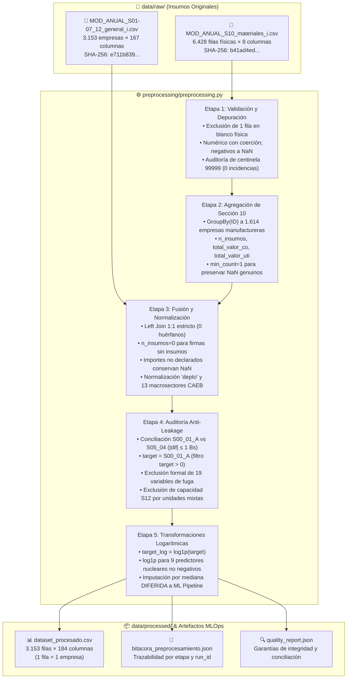

# Pipeline de Preprocesamiento de Datos: EAIMCS 2017-2018 (INE Bolivia)

> **Documento Metodológico y Técnico del Preprocesamiento del Dataset**  
> **Módulo ejecutable canónico:** [`preprocessing/preprocessing.py`](file:///c:/Users/raque/OneDrive/Documentos/ProyML/finalProjectML/preprocessing/preprocessing.py)  
> **Bitácora de ejecución inmutable:** [`preprocessing/bitacora_preprocesamiento.json`](file:///c:/Users/raque/OneDrive/Documentos/ProyML/finalProjectML/preprocessing/bitacora_preprocesamiento.json)  
> **Reporte de calidad y contrato de datos:** [`preprocessing/quality_report.json`](file:///c:/Users/raque/OneDrive/Documentos/ProyML/finalProjectML/preprocessing/quality_report.json)  
> **Suite de pruebas unitarias:** [`tests/test_data_contract.py`](file:///c:/Users/raque/OneDrive/Documentos/ProyML/finalProjectML/tests/test_data_contract.py)  
> **Dataset final producido:** [`data/processed/dataset_procesado.csv`](file:///c:/Users/raque/OneDrive/Documentos/ProyML/finalProjectML/data/processed/dataset_procesado.csv) (3.153 filas × 184 columnas)

---

## 1. Introducción y Justificación del Preprocesamiento

La **Encuesta a la Industria Manufacturera, Comercio y Servicios (EAIMCS 2017-2018)**, publicada en el catálogo ANDA del Instituto Nacional de Estadística (INE) de Bolivia (código de estudio `BOL-INE-EAIMCS-2017-2018`), recoge información económica detallada de empresas medianas y grandes en todo el territorio nacional.

Sin embargo, los microdatos crudos provistos por el INE no están estructurados directamente para el entrenamiento de algoritmos de Machine Learning supervisado (regresión de ingresos operativos anuales). Presentan desafíos metodológicos y computacionales sustanciales:

1. **Estructuras relacionales heterogéneas:** Los datos se encuentran fragmentados en múltiples tablas con granularidad dispar: el módulo general está a nivel de **empresa** ($1:1$), mientras que el detalle de materias primas e insumos (Sección 10) está en **formato largo** ($N:1$), con múltiples registros por empresa.
2. **Códigos de control administrativo y centinelas (99999):** En encuestas oficiales, cuando una identidad contable no cuadraba o existían inconsistencias de autorelevamiento, los validadores del INE imputaron códigos centinela como `99999`.
3. **Dispersión categórica extrema:** El clasificador de actividades económicas CAEB (basado en CIIU Rev. 4) contiene más de 400 subclases a 5 dígitos, provocando dispersión masiva (*curse of dimensionality*) si se codificaran sin agregación económica previa.
4. **Riesgo crítico de Fuga de Información (*Data Leakage*):** El dataset crudo incluye variables intermedias que descomponen algebraicamente el total de ingresos (Sección 5), así como 15 variables de Cuentas Nacionales calculadas post-encuesta por el INE (`VBP`, `VA`, `CI`, `OGO`, etc.). Si un modelo predictivo tiene acceso a estas columnas, memorizará la identidad contable trivial, invalidando su capacidad de generalización econométrica.
5. **Asimetría de Pareto y escala monetaria:** Los ingresos operativos y los costos de las empresas medianas y grandes abarcan órdenes de magnitud desde 1.28 millones hasta más de 5.290 millones de Bolivianos (Bs). Esta distribución de cola pesada genera heterocedasticidad severa e inestabilidad en modelos lineales y basados en gradiente si no se aplica una transformación de estabilización de varianza.

Para solventar estos problemas de forma estricta, auditable y determinista, se diseñó el pipeline automatizado en [`preprocessing/preprocessing.py`](file:///c:/Users/raque/OneDrive/Documentos/ProyML/finalProjectML/preprocessing/preprocessing.py), gobernado por contratos de datos que garantizan cero pérdida arbitraria de informantes y cero fuga de información.

---

## 2. Insumos Crudos y Cadena de Transformación

El pipeline toma exclusivamente los dos archivos crudos relevantes del repositorio `data/raw/` y genera un dataset consolidado con bitácoras criptográficas:



### Ficha Técnica de las Fuentes Crudas

| Archivo Crudo | Nivel de Observación | Filas Físicas | Filas Válidas | Columnas | SHA-256 Hash |
|---|---|---|---|---|---|
| `MOD_ANUAL_S01-07_12_general_i.csv` | Empresa ($1:1$) | 3.153 | 3.153 | 167 (152 encuesta + 15 derivados locales) | `e711b839d1e83e62b7e81ec64d0f64ea7a2d0eb06974662e99c5bfdc204927f7` |
| `MOD_ANUAL_S10_materiales_i.csv` | Insumo / Ítem ($N:1$) | 6.428 | 6.427 | 8 | `b41ad4ed15c427cb20c25a76732ff43f47834158b7eadf6c58a5141b80e18b4a` |

> [!NOTE]
> En `MOD_ANUAL_S10_materiales_i.csv`, 1 fila física del archivo original estaba completamente vacía (`NaN` en todas sus columnas). El cargador [`load_raw_datasets()`](file:///c:/Users/raque/OneDrive/Documentos/ProyML/finalProjectML/preprocessing/preprocessing.py#L90-L133) detecta y excluye esa fila automáticamente antes de evaluar la presencia de claves, dejando exactamente 6.427 registros utilizables pertenecientes a 1.614 empresas únicas.

---

## 3. Desglose Exhaustivo de las 5 Etapas del Preprocesamiento

El pipeline se ejecuta de manera secuencial a través de la función [`run_preprocessing()`](file:///c:/Users/raque/OneDrive/Documentos/ProyML/finalProjectML/preprocessing/preprocessing.py#L306-L524), registrando métricas cuantitativas antes y después de cada fase:

```
===================================================================================
ETAPAS DEL PIPELINE DE PREPROCESAMIENTO
===================================================================================
Etapa 1: Validación y Depuración de Valores Monetarios
         (Filtro de negativos, auditoría 99999, tipos de datos)
Etapa 2: Agregación Relacional de la Sección 10 (Materias Primas)
         (Reducción de formato largo a nivel empresarial 1:1)
Etapa 3: Fusión Relacional (Left Join) y Normalización Categórica
         (Cruce 1:1, banderas de insumos, Depto y 13 Macrosectores CAEB)
Etapa 4: Conciliación del Objetivo y Políticas Anti-Fuga (Anti-Leakage)
         (Auditoría S00_01_A vs S05_04, exclusión de 19 variables y S12)
Etapa 5: Transformaciones Logarítmicas de Estabilización de Varianza
         (Cálculo de log1p para target y 9 predictores; preservación de NaN)
===================================================================================
```

---

### Etapa 1: Validación y Depuración de Valores Monetarios

* **Objetivo:** Asegurar la coherencia matemática y contable de los campos monetarios de materias primas sin alterar artificialmente los datos reales.
* **Transformaciones aplicadas:**
  1. **Conversión de tipo:** Los campos `valor_co` (compras de insumos) y `valor_uti` (utilización de insumos) se convierten a tipo punto flotante utilizando `pd.to_numeric(..., errors="coerce")`.
  2. **Tratamiento de valores negativos:** En contabilidad de materias primas, los importes de compras y consumos son necesariamente no negativos ($\ge 0$). Los valores negativos representan errores de digitación o ajustes erróneos de encuesta. Se transforman a `NaN` mediante la condición `.where(s >= 0)` (se registró 1 valor negativo afectado). No se transforman en cero artificialmente para no distorsionar la media ni crear un gasto ficticio de Bs 0.
  3. **Auditoría de Códigos Centinela (`99999`):**  
     En la metodología del INE para las Secciones 3 y 10, cuando la identidad contable de balance de materiales:
     $$\text{Utilización} = \text{Compras} + \text{Inventario Inicial} - \text{Inventario Final}$$
     no cerraba, se contemplaba asignar el centinela `99999`.
     * El pipeline audita exhaustivamente la presencia exacta del valor `99999.0` tanto en materiales como en los predictores generales.
     * En el extracto oficial utilizado, **se encontraron exactamente 0 incidencias del código 99999**.
     * **Regla de integridad:** El pipeline establece que un importe alto no debe recortarse ni etiquetarse como centinela a menos que exista una regla documentada específica por campo.
  4. **Preservación de colas pesadas:** No se aplicó winsorización ni recorte de valores atípicos (*outliers*) superiores, dado que las grandes empresas manufactureras concentran legítimamente importes multimillonarios acordes a la escala económica de Bolivia.

---

### Etapa 2: Agregación Relacional de la Sección 10 (Materias Primas)

* **Objetivo:** Colapsar la tabla de estructura larga ($N$ insumos por empresa) a nivel de empresa ($1$ fila por `ID` único) para integrarla al modelo de regresión.
* **Lógica de reducción:**
  La tabla limpia de materiales (6.427 registros) se agrupa mediante `groupby("ID")` generando tres métricas estructurales clave:
  1. **`n_insumos` (Variedad de materias primas):** Conteo de insumos y materiales declarados por la empresa:
     $$\text{n\_insumos} = \text{size}(\text{materia})$$
  2. **`total_valor_co` (Compras totales de insumos en Bs):** Suma agregada de las compras de insumos:
     $$\text{total\_valor\_co} = \sum \text{valor\_co\_clean}$$
  3. **`total_valor_uti` (Utilización total de materias primas en Bs):** Suma agregada de materias primas efectivamente consumidas en el proceso productivo:
     $$\text{total\_valor\_uti} = \sum \text{valor\_uti\_clean}$$
* **Preservación de nulos (`min_count=1`):**  
  Las sumas se configuran con `lambda s: s.sum(min_count=1)`. Esto garantiza que si una empresa reportó insumos pero todos sus valores monetarios eran ausentes (`NaN`), la suma resultante sea `NaN` y no un falso `0.0`.
* **Resultado de la etapa:** De 6.427 registros de insumos se obtiene una tabla agregada de **1.614 empresas únicas**, correspondiente al 100% de las empresas que declararon actividad de transformación en dicho módulo.

---

### Etapa 3: Fusión Relacional (Left Join) y Normalización Categórica

* **Objetivo:** Unir la información general de la empresa con los agregados de materias primas, respetando la cardinalidad y normalizando variables de radicatoria geográfica y actividad económica.
* **Transformaciones aplicadas:**
  1. **Fusión `Left Join` estricto:**  
     Se ejecuta `df_gen.merge(df_mat_agg, on="ID", how="left", validate="one_to_one")`.  
     Se valida rigurosamente la cardinalidad `one_to_one` (un ID en general enlaza como máximo con un ID agregado). La auditoría confirma que **0 filas de materiales quedaron huérfanas** (todas las 1.614 empresas de materiales existen en el módulo general).
  2. **Bandera booleana de declaración de insumos:**  
     Se crea la columna `has_material_record = n_insumos.notna()`. Permite al modelo y al análisis exploratorio distinguir rápidamente entre empresas con módulo fabril versus firmas comerciales o de servicios.
  3. **Tratamiento semántico de empresas sin insumos:**  
     Para las 1.539 empresas (comercio, banca, servicios, etc.) que legítimamente no consumen materias primas de transformación:
     * `n_insumos`: Se imputa con `0` mediante `.fillna(0)`, pues el número de insumos declarados es formal y legítimamente cero.
     * `total_valor_co` y `total_valor_uti`: **Permanecen como ausentes (`NaN`)**. Fabricar un cero monetario implicaría declarar que la empresa tuvo compras de materias primas por Bs 0 cuando en realidad la sección no le aplicaba. La imputación estadística se difiere al pipeline de Machine Learning.
  4. **Normalización territorial (`depto`):**  
     A partir del campo `C2_01`, se limpian espacios en blanco y se unifican caracteres en mayúsculas estrictas. Se identifican los 9 departamentos de Bolivia:
     * *Santa Cruz:* 1.427 empresas (45,26 %)
     * *Cochabamba:* 649 empresas (20,58 %)
     * *La Paz:* 631 empresas (20,01 %)
     * *Tarija:* 131 empresas (4,15 %)
     * *Oruro:* 110 empresas (3,49 %)
     * *Chuquisaca:* 74 empresas (2,35 %)
     * *Potosí:* 58 empresas (1,84 %)
     * *Beni:* 50 empresas (1,59 %)
     * *Pando:* 23 empresas (0,73 %)
  5. **Normalización sectorial (`sector_macro`):**  
     El clasificador oficial CAEB original posee más de 400 clases numéricas a 5 dígitos. Se aplicó la función [`map_caeb_to_sector()`](file:///c:/Users/raque/OneDrive/Documentos/ProyML/finalProjectML/preprocessing/preprocessing.py#L192-L239), agrupando los dos primeros dígitos según las divisiones oficiales de la CIIU Rev. 4 en 14 macrosectores teóricos, de los cuales **13 macrosectores se observan empíricamente** en el extracto local:

| Macrosector Económico Observado (`sector_macro`) | Códigos CAEB / CIIU Rev. 4 | Empresas | % del Total |
|---|---|---|---|
| **Comercio Mayorista y Minorista** | Divisiones 45–47 | 1.243 | 39,42 % |
| **Industria Manufacturera** | Divisiones 10–33 | 489 | 15,51 % |
| **Construcción** | Divisiones 41–43 | 430 | 13,64 % |
| **Transporte y Almacenamiento** | Divisiones 49–53 | 182 | 5,77 % |
| **Alojamiento y Servicios de Comida** | Divisiones 55–56 | 137 | 4,35 % |
| **Servicios Profesionales y Técnicos** | Divisiones 69–75 | 135 | 4,28 % |
| **Servicios Administrativos y de Apoyo** | Divisiones 77–82 | 122 | 3,87 % |
| **Información y Comunicaciones** | Divisiones 58–63 | 114 | 3,62 % |
| **Educación** | División 85 | 94 | 2,98 % |
| **Salud y Asistencia Social** | Divisiones 86–88 | 77 | 2,44 % |
| **Electricidad, Gas y Agua** | Divisiones 35–39 | 54 | 1,71 % |
| **Actividades Inmobiliarias** | División 68 | 40 | 1,27 % |
| **Otras Actividades de Servicios** | Divisiones 90–99 y otros | 36 | 1,14 % |
| **Total** | — | **3.153** | **100,00 %** |

---

### Etapa 4: Políticas Anti-Leakage y Conciliación del Objetivo

* **Objetivo:** Definir formalmente la variable objetivo a estimar y excluir con rigor matemático toda columna que genere fuga de datos (*data leakage*).
* **Acciones fundamentales:**
  1. **Conciliación de la Variable Objetivo ($Y$):**  
     La encuesta reporta los ingresos en dos secciones:
     * `S00_01_A`: Valor total de ingresos operativos en la carátula contable (Sección 0).
     * `S05_04`: Total de ingresos operativos declarado en el detalle de la Sección 5 ($S05\_01 + S05\_02 + S05\_03$).
     * **Resultado de la prueba de concordancia:**  
       - **3.093 empresas (98,10 %)** coinciden de manera exacta e idéntica.
       - **60 empresas (1,90 %)** presentan discrepancias menores por redondeo de centavos o precisión de cálculo, todas estrictamente menores o iguales a **Bs 1,00** ($|S00\_01\_A - S05\_04| \le 1.0\text{ Bs}$).
       - Cero empresas superan la tolerancia de Bs 1.
     * **Definición canónica:** Se adopta formalmente **`target = S00_01_A`**. Se valida que todas las 3.153 empresas tengan ingresos positivos válidos (`target > 0`), reteniendo el 100% de las observaciones (0 eliminadas).
  2. **Exclusión estricta de 19 columnas de Fuga de Datos (*Anti-Leakage*):**  
     Para garantizar que el modelo aprenda a proyectar ingresos a partir de insumos y capacidad productiva y no memorice una ecuación contable trivial, se prohíbe la inclusión de las siguientes 19 columnas:

| Categoría | Columnas Excluidas | Razón Técnica y Econométrica de Exclusión |
|---|---|---|
| **Componentes de Ingresos de Sección 5** | `S05_01`, `S05_02`, `S05_03`, `S05_04` | Fuga directa: $S05\_04 = S05\_01 + S05\_02 + S05\_03 \approx \text{target}$. Incluir cualquiera de ellas permitiría al modelo resolver la regresión con $R^2 \approx 1.0$ de manera espuria. |
| **Cuentas de Producción de Cuentas Nacionales (INE)** | `VPA`, `PC`, `ISPOINF`, `VIPP`, `VBP` | El Valor Bruto de Producción (`VBP`) y la Producción Característica (`PC`) integran las ventas e ingresos por facturación ajustados por inventarios. |
| **Cuentas de Valor Agregado y Consumo Intermedio** | `EAC`, `OGO`, `VUMPEEI`, `CI`, `VA` | El Valor Agregado (`VA`) y el Excedente Bruto de Explotación (`OGO`) se calculan restando el Consumo Intermedio (`CI`) del Valor Bruto de Producción, conteniendo directamente el ingreso facturado. |
| **Ratios post-encuesta del INE** | `SSB`, `OPP`, `PS`, `R`, `D` | Ratios calculados por el INE que incorporan ingresos en su numerador o denominador para auditoría macroeconómica. |

  3. **Política de Capacidad de Almacenamiento (Sección 12):**  
     Las variables `S12_01_B` (capacidad de materia prima) y `S12_02_B` (capacidad de producto) registran cantidades numéricas, pero sus unidades físicas asociadas (`S12_01_C` y `S12_02_C`) corresponden a unidades heterogéneas (toneladas, litros, unidades, metros cúbicos, cajas, etc.). Sumar o comparar directamente estas cantidades sin una conversión física previa generaría ruido. **Se excluyen de los predictores numéricos del modelo** y se conservan como variables descriptivas en el dataset procesado para análisis exploratorio.

---

### Etapa 5: Transformaciones Logarítmicas de Estabilización de Varianza

* **Objetivo:** Reducir la asimetría de cola pesada, linealizar relaciones de producción multiplicativas (tipo Cobb-Douglas) y estabilizar la varianza residual.
* **Transformación matemática:**  
  Se aplica la función monótona:
  $$x_{\log} = \ln(1 + x) = \text{log1p}(x)$$
  Propiedades que justifican su elección frente al logaritmo natural estándar ($\ln(x)$):
  1. Está definida en $x = 0$, pues $\ln(1 + 0) = 0$, permitiendo incorporar firmas con dotaciones nulas (ej. empresas con 0 insumos declarados).
  2. Mantiene una aproximación lineal para valores pequeños: $\ln(1 + x) \approx x$ cuando $x \to 0$.
  3. Comprime uniformemente las colas derechas de magnitud multimillonaria sin perder orden ordinal.
* **Campos transformados:**
  * **Target:** `target_log = np.log1p(target)`
  * **9 Predictores Numéricos Fundamentales:**
    1. `log_S01_05_A`: $\ln(1 + \text{Total personal ocupado})$
    2. `log_S01_03_C`: $\ln(1 + \text{Sueldos y salarios básicos anuales})$
    3. `log_S01_14`: $\ln(1 + \text{Otras remuneraciones y aportes patronales})$
    4. `log_S02_09`: $\ln(1 + \text{Consumo de energía, agua y combustibles})$
    5. `log_S07_09_E`: $\ln(1 + \text{Valor histórico final de activos fijos})$
    6. `log_S06_06_B`: $\ln(1 + \text{Inventarios finales totales})$
    7. `log_n_insumos`: $\ln(1 + \text{Variedad de materias primas})$
    8. `log_total_valor_co`: $\ln(1 + \text{Compras de materias primas})$
    9. `log_total_valor_uti`: $\ln(1 + \text{Utilización de materias primas})$
* **Estrategia Anti-Fuga de Imputación Diferida:**  
  > [!IMPORTANT]
  > En esta etapa de preprocesamiento **NO se imputan valores ausentes con la media o mediana global**. Si se imputara la mediana sobre todo el dataset antes de separar los datos en *Train* y *Test*, la información del conjunto de prueba contaminaría el entrenamiento (*data leakage*).  
  > En consecuencia, los valores `NaN` en `log_total_valor_co` y `log_total_valor_uti` se preservan intactos. La imputación por mediana (`SimpleImputer(strategy="median")`) y la estandarización (`StandardScaler()`) se realizan exclusivamente **DENTRO** del `Pipeline` de Scikit-Learn en [`models/train.py`](file:///c:/Users/raque/OneDrive/Documentos/ProyML/finalProjectML/models/train.py#L90-L100), aprendiendo los parámetros únicamente sobre los pliegues de entrenamiento de cada iteración de validación cruzada.

---

## 4. Resumen Cuantitativo de la Evolución del Dataset

A continuación se resume la bitácora de transformación registrada formalmente en [`preprocessing/bitacora_preprocesamiento.json`](file:///c:/Users/raque/OneDrive/Documentos/ProyML/finalProjectML/preprocessing/bitacora_preprocesamiento.json):

| Etapa | Operación Principal | Filas Antes | Columnas Antes | Filas Después | Columnas Después | Observaciones / Registros Afectados |
|---|---|---|---|---|---|---|
| **Línea Base** | Carga de CSV crudos | — | — | 3.153 (gen) / 6.427 (mat) | 167 (gen) / 8 (mat) | 1 fila física en blanco excluida en materiales. |
| **Etapa 1** | Validación monetaria | 6.427 | 8 | 6.427 | 10 | 1 valor negativo convertido a NaN; 0 centinelas 99999. |
| **Etapa 2** | Agregación Sección 10 | 6.427 | 10 | 1.614 | 4 | Reducción a 1.614 empresas únicas con insumos declarados. |
| **Etapa 3** | Fusión y Normalización | 3.153 | 167 | 3.153 | 173 | Cruce 1:1; 1.539 empresas asignadas con n_insumos=0; 13 sectores. |
| **Etapa 4** | Políticas Anti-Leakage | 3.153 | 173 | 3.153 | 174 | Conciliación de objetivo (60 dif ≤ Bs 1); 19 columnas de fuga marcadas. |
| **Etapa 5** | Transformación Log | 3.153 | 174 | **3.153** | **184** | 10 columnas log1p generadas; NaN preservados para ML Pipeline. |

### Inventario de Columnas Agregadas al Dataset Final (17 nuevas columnas)

El dataset procesado contiene **184 columnas en total**: las 167 columnas originales de la base general más 17 columnas derivadas del preprocesamiento:

1. `n_insumos`: Conteo de insumos de materias primas (0 para no manufactureras).
2. `total_valor_co`: Compras de materias primas en Bs (`NaN` para no manufactureras).
3. `total_valor_uti`: Utilización de materias primas en Bs (`NaN` para no manufactureras).
4. `has_material_record`: Indicador booleano de pertenencia al módulo de materiales.
5. `depto`: Nombre estandarizado del departamento en mayúsculas.
6. `sector_macro`: Macrosector económico normalizado (13 categorías observadas).
7. `target`: Variable objetivo en Bolivianos (`S00_01_A`).
8. `target_log`: Variable objetivo en escala logarítmica ($\ln(1 + \text{target})$).
9. `log_S01_05_A`: $\ln(1 + \text{Personal ocupado})$
10. `log_S01_03_C`: $\ln(1 + \text{Sueldos y salarios})$
11. `log_S01_14`: $\ln(1 + \text{Otras remuneraciones})$
12. `log_S02_09`: $\ln(1 + \text{Total energía, agua y combustibles})$
13. `log_S07_09_E`: $\ln(1 + \text{Activos fijos históricos finales})$
14. `log_S06_06_B`: $\ln(1 + \text{Inventarios finales})$
15. `log_n_insumos`: $\ln(1 + \text{Variedad de insumos})$
16. `log_total_valor_co`: $\ln(1 + \text{Compras de materias primas})$
17. `log_total_valor_uti`: $\ln(1 + \text{Utilización de materias primas})$

---

## 5. Protocolo de Calidad y Pruebas Unitarias

Para evitar regresiones en futuras ejecuciones o cambios de datos, el proyecto cuenta con una suite automatizada de pruebas unitarias en [`tests/test_data_contract.py`](file:///c:/Users/raque/OneDrive/Documentos/ProyML/finalProjectML/tests/test_data_contract.py):

* `test_extract_structure_and_target_reconciliation`: Valida que la estructura cruda sea de 3.153 × 167 y 6.427 × 8, comprueba que la clave `ID` sea única, verifica que exactamente 60 empresas presenten diferencias de redondeo entre `S00_01_A` y `S05_04`, y asegura que ninguna diferencia supere Bs 1,00.
* `test_materials_keep_unknown_separate_from_zero`: Comprueba que importes negativos pasen a `NaN`, que el centinela 99999 se mantenga si no hay regla por campo, y que las empresas sin datos conserven `NaN` en vez de un cero artificial.
* `test_missing_material_record_is_not_fabricated_monetary_zero`: Verifica que una empresa comercial o de servicios obtenga `n_insumos = 0`, `has_material_record = False` y `total_valor_co = NaN`.
* `test_capacity_requires_unit_and_is_not_model_predictor`: Asegura que `S12_01_B` y `S12_02_B` no figuren en la lista de predictores del modelo.
* `test_processed_dataset_preserves_cardinality`: Garantiza que el dataset final tenga exactamente 3.153 filas, `ID` únicos, 13 macrosectores observados y preservación de nulos en las empresas sin registro fabril.

---

## 6. Guía de Ejecución y Reproducibilidad

Para regenerar el dataset procesado y ejecutar las pruebas de validación desde la terminal, ejecute:

```powershell
# 1. Activar el entorno virtual
.\venv\Scripts\Activate.ps1

# 2. Ejecutar el pipeline canónico de preprocesamiento
python preprocessing/preprocessing.py

# 3. Ejecutar las pruebas unitarias del contrato de datos
python -m unittest discover -s tests -p "test_data_contract.py"
```

El script genera automáticamente:
- `data/processed/dataset_procesado.csv` (y versión `.parquet` si el motor está disponible).
- `preprocessing/bitacora_preprocesamiento.json` y su copia en `dashboard/artifacts/`.
- `preprocessing/quality_report.json`.
- Resumen en consola de la distribución estadística del objetivo.
