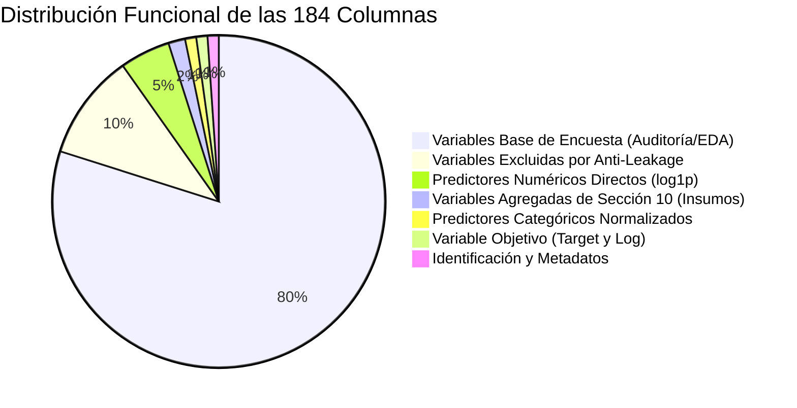

# Diccionario de Datos: Dataset Preprocesado (EAIMCS 2017-2018)

> **Catálogo Exhaustivo de Variables del Dataset Modelable Consolidado**  
> **Archivo generado:** [`data/processed/dataset_procesado.csv`](file:///c:/Users/raque/OneDrive/Documentos/ProyML/finalProjectML/data/processed/dataset_procesado.csv) (y versión Parquet [`dataset_procesado.parquet`](file:///c:/Users/raque/OneDrive/Documentos/ProyML/finalProjectML/data/processed/dataset_procesado.parquet))  
> **Documento complementario (Microdatos Crudos):** [`docs/02_diccionario_datos_EAIMCS.md`](file:///c:/Users/raque/OneDrive/Documentos/ProyML/finalProjectML/docs/02_diccionario_datos_EAIMCS.md)  
> **Documento metodológico del pipeline:** [`docs/03_preprocesamiento.md`](file:///c:/Users/raque/OneDrive/Documentos/ProyML/finalProjectML/docs/03_preprocesamiento.md)  
> **Módulo generador:** [`preprocessing/preprocessing.py`](file:///c:/Users/raque/OneDrive/Documentos/ProyML/finalProjectML/preprocessing/preprocessing.py)

---

## 1. Ficha Técnica del Dataset Final

| Atributo | Especificación |
|---|---|
| **Nombre del archivo** | `dataset_procesado.csv` |
| **Dimensiones finales** | **3.153 filas (observaciones) × 184 columnas (variables)** |
| **Unidad de análisis** | Empresa mediana o grande de Bolivia (1 fila = 1 empresa) |
| **Clave primaria de enlace** | `ID` (entero único anonimizado) |
| **Cobertura territorial** | 9 departamentos de Bolivia (Santa Cruz, Cochabamba, La Paz, Tarija, Oruro, Chuquisaca, Potosí, Beni, Pando) |
| **Cobertura sectorial** | 13 macrosectores observados (Comercio, Industria Manufacturera, Construcción, Servicios, etc.) |
| **Moneda oficial de reporte** | Bolivianos (Bs) |
| **Periodo contable** | Gestión 2017 (con cierres fiscales escalonados según actividad económica hasta junio 2018) |
| **Variable objetivo principal** | `target` (ingresos operativos anuales en Bs) y `target_log` ($\ln(1 + \text{target})$) |
| **Tipo de tarea de ML** | Aprendizaje Supervisado — Regresión Continua |

---

## 2. Taxonomía y Esquema Global de las 184 Columnas

Para facilitar la auditoría analítica y el desarrollo de modelos predictivos, las **184 columnas** del dataset procesado se clasifican funcionalmente en los siguientes 7 grupos:



| Grupo Funcional | Cantidad | Descripción y Rol en el Sistema |
|---|:---:|---|
| **1. Identificación y Metadatos** | 2 | Clave única de la empresa (`ID`) y bandera de enlace al módulo de insumos (`has_material_record`). |
| **2. Variable Objetivo ($Y$)** | 2 | Variable dependiente a estimar: escala original en Bs (`target`) y escala logarítmica (`target_log`). |
| **3. Predictores Categóricos Normalizados** | 2 | Radicatoria departamental homogénea (`depto`) y macrosector económico (`sector_macro`). |
| **4. Predictores Numéricos Directos ($\text{log1p}$)** | 9 | Variables nucleares de escala, dotación de factores productivos y consumo transformadas con $\ln(1 + x)$. |
| **5. Agregados de la Sección 10 (Insumos)** | 3 | Métricas consolidadas de compras, uso y variedad de materias primas (`n_insumos`, `total_valor_co`, `total_valor_uti`). |
| **6. Variables Excluidas (*Anti-Leakage*)** | 19 | Columnas de Sección 5 y 15 agregados macroeconómicos del INE prohibidos para evitar sobreajuste espurio. |
| **7. Variables de Encuesta Base (Auditoría / EDA)** | 147 | Columnas de Carátula y Secciones 1, 2, 3, 4, 6, 7 y 12 conservadas intactas para trazabilidad y dashboards. |
| **TOTAL** | **184** | **100% de las variables estructuradas en el dataset procesado.** |

---

## 3. Módulo 1: Identificación y Metadatos de Enlace

| Columna | Tipo de Dato | Origen | Descripción | Rango / Valores Posibles | Tratamiento de Nulos |
|---|---|---|---|---|---|
| `ID` | Entero (`int64`) | Carátula | Identificador numérico anonimizado único asignado por el INE a cada empresa. Llave primaria de unión relacional. | 1 a 3.153 | No admite nulos (100% informada). |
| `has_material_record` | Booleano (`bool`) | Preprocesamiento | Indica si la empresa declaró información en el módulo de materias primas e insumos (Sección 10). | `True` (1.614 empresas) / `False` (1.539 empresas) | No admite nulos. |

---

## 4. Módulo 2: Variable Objetivo (Target $Y$)

| Columna | Tipo de Dato | Origen / Fórmula | Descripción | Unidad | Rango y Distribución Observada | Rol en Modelado |
|---|---|---|---|---|---|---|
| **`target`** | Punto flotante (`float64`) | `S00_01_A` (Carátula) | **TOTAL Ingresos Operativos Anuales** de la empresa en la gestión fiscal 2017. Representa la facturación bruta por venta de productos, mercaderías y prestación de servicios. Conciliada con `S05_04` ($|S00\_01\_A - S05\_04| \le 1\text{ Bs}$). | Bolivianos (Bs) | • Mínimo: Bs 1.285.236,00<br/>• Q1 (25%): Bs 7.529.964,00<br/>• **Mediana (50%): Bs 15.829.420,00**<br/>• Media: Bs 56.892.530,00<br/>• Q3 (75%): Bs 36.869.590,00<br/>• Máximo: Bs 5.292.082.000,00<br/>• Nulos: 0 (100% válido) | **Variable dependiente real ($Y$)** |
| **`target_log`** | Punto flotante (`float64`) | $\ln(1 + \text{target})$ | **Transformación logarítmica natural monótona** del target para estabilizar varianza residual y corregir la asimetría de Pareto de cola derecha. | Adimensional ($\log(\text{Bs})$) | • Mínimo: 14,07<br/>• Q1: 15,83<br/>• **Mediana: 16,58**<br/>• Media: 16,73<br/>• Q3: 17,42<br/>• Máximo: 22,39<br/>• Nulos: 0 | **Variable dependiente optimizada por los algoritmos ($y_{\log}$)** |

> [!NOTE]
> En la inferencia productiva, la estimación del ingreso en Bolivianos ($\hat{Y}$) se recupera a partir de la predicción logarítmica $\hat{y}_{\log}$ aplicando la corrección econométrica por la desigualdad de Jensen (Factor de Duan Smearing):
> $$\hat{Y} = \exp(\hat{y}_{\log}) \times \alpha_{\text{Duan}} - 1$$
> donde $\alpha_{\text{Duan}} = \frac{1}{N_{\text{train}}}\sum_{i=1}^{N_{\text{train}}} \exp(y_i - \hat{y}_i)$.

---

## 5. Módulo 3: Predictores Numéricos Directos del Modelo (Originales y $\text{log1p}$)

Estos **9 predictores nucleares** representan las dotaciones de factores productivos (capital, trabajo, insumos, energía e inventarios). El modelo consume directamente las versiones transformadas con $\text{log1p}$:

| Columna Original | Columna Transformada ($\text{log1p}$) | Sección Encuesta | Descripción del Factor Productivo | Unidad | Estadísticas Descriptivas (Original) | Tratamiento de Nulos en ML Pipeline |
|---|---|---|---|---|---|---|
| `S01_05_A` | **`log_S01_05_A`** | Sección 1 | **Total Personal Ocupado:** Suma de personal permanente, eventual y no remunerado que presta servicios en la empresa. | Personas | Mín: 1,00<br/>Mediana: 27,44<br/>Media: 91,51<br/>Máx: 4.744,00 | 0 nulos (100% informada). |
| `S01_03_C` | **`log_S01_03_C`** | Sección 1 | **Sueldos y Salarios Básicos Anuales:** Masa salarial básica pagada al total del personal remunerado. | Bs | Mín: Bs 0,00<br/>Mediana: Bs 1.203.559,00<br/>Media: Bs 4.941.069,00<br/>Máx: Bs 460.948.300,00 | 0 nulos. Cero conservado en $\ln(1+0)=0$. |
| `S01_14` | **`log_S01_14`** | Sección 1 | **Total Otras Remuneraciones:** Aguinaldos, indemnizaciones, bonos de producción, horas extras y aportes patronales (Salud, AFPs, Pro-Vivienda). | Bs | Mín: Bs 0,00<br/>Mediana: Bs 507.037,00<br/>Media: Bs 2.052.871,00<br/>Máx: Bs 191.077.300,00 | 0 nulos. |
| `S02_09` | **`log_S02_09`** | Sección 2 | **Total Energía, Agua y Combustibles:** Gasto anual en energía eléctrica, agua potable, gas natural por red, diésel, gasolina, GLP y lubricantes. Proxy directo de intensidad operativa. | Bs | Mín: Bs 0,00<br/>Mediana: Bs 81.650,00<br/>Media: Bs 846.541,00<br/>Máx: Bs 163.639.400,00 | 0 nulos. |
| `S07_09_E` | **`log_S07_09_E`** | Sección 7 | **Activos Fijos (Total Valor Histórico Final):** Valor contable neto final de edificaciones, maquinaria, vehículos, equipos de computación, muebles, herramientas y terrenos. Proxy de capacidad instalada de capital. | Bs | Mín: Bs 0,00<br/>Mediana: Bs 4.887.820,00<br/>Media: Bs 38.308.200,00<br/>Máx: Bs 3.518.570.000,00 | 0 nulos. |
| `S06_06_B` | **`log_S06_06_B`** | Sección 6 | **Total Inventarios Finales:** Existencias finales al cierre de gestión de productos en proceso, productos terminados, mercadería y materias primas. | Bs | Mín: Bs 0,00<br/>Mediana: Bs 1.144.380,00<br/>Media: Bs 12.355.820,00<br/>Máx: Bs 1.050.840.000,00 | 0 nulos. |
| `n_insumos` | **`log_n_insumos`** | Sección 10 (agregada) | **Variedad de Insumos Declarados:** Conteo de materias primas, envases y materiales registrados en el módulo fabril. | Conteo | Mín: 0<br/>Mediana: 1<br/>Media: 2,04<br/>Máx: 23 | 0 nulos (1.539 firmas no manufactureras asignadas legítimamente con 0). |
| `total_valor_co` | **`log_total_valor_co`** | Sección 10 (agregada) | **Compras Totales de Materias Primas:** Gasto anual en compras de insumos para transformación. | Bs | Mín: Bs 0,00<br/>Mediana: Bs 3.230.470,00<br/>Media: Bs 21.669.460,00<br/>Máx: Bs 3.867.071.000,00 | 1.540 ausentes (1.539 firmas no manufactureras + 1 sin compras). Imputado con la mediana del fold de entrenamiento. |
| `total_valor_uti` | **`log_total_valor_uti`** | Sección 10 (agregada) | **Utilización Real de Materias Primas:** Valor de los insumos y materias primas efectivamente consumidos e incorporados en la producción fabril. | Bs | Mín: Bs 0,00<br/>Mediana: Bs 3.204.284,00<br/>Media: Bs 21.527.080,00<br/>Máx: Bs 3.838.233.000,00 | 1.539 ausentes (firmas no manufactureras). Imputado con la mediana del fold de entrenamiento. |

---

## 6. Módulo 4: Predictores Categóricos Normalizados del Modelo

El modelo utiliza dos variables categóricas normalizadas, procesadas mediante `OneHotEncoder(handle_unknown="ignore", sparse_output=False)`:

### 1. `depto` (Departamento de Radicatoria)

Normalización estandarizada de la variable `C2_01`:

| Categoría (`depto`) | Empresas | % del Total | Justificación y Perfil Económico |
|---|---|---|---|
| **SANTA CRUZ** | 1.427 | 45,26 % | Polo agroindustrial, comercial y de servicios más grande de Bolivia. |
| **COCHABAMBA** | 649 | 20,58 % | Centro manufacturero, avícola, alimenticio y de servicios del valle central. |
| **LA PAZ** | 631 | 20,01 % | Sede de gobierno, servicios financieros, comercio mayorista y confecciones. |
| **TARIJA** | 131 | 4,15 % | Sector vitivinícola, hidrocarburífero y comercio fronterizo. |
| **ORURO** | 110 | 3,49 % | Corredor logístico minero y de comercio internacional. |
| **CHUQUISACA** | 74 | 2,35 % | Industria del cemento, chocolatería y servicios de educación/salud. |
| **POTOSI** | 58 | 1,84 % | Minería metálica, turismo y servicios complementarios. |
| **BENI** | 50 | 1,59 % | Ganadería, agropecuaria tropical y extracción de recursos. |
| **PANDO** | 23 | 0,73 % | Extracción de castaña, madera y comercio amazónico. |
| **TOTAL** | **3.153** | **100,00 %** | — |

### 2. `sector_macro` (Macrosector Económico CAEB)

Agrupación sistemática del código `actividad_pricipal_codigo_V1` basada en las 21 secciones de la Clasificación Industrial Internacional Uniforme (CIIU Rev. 4). De los 14 macrosectores definidos teóricamente en la función [`map_caeb_to_sector()`](file:///c:/Users/raque/OneDrive/Documentos/ProyML/finalProjectML/preprocessing/preprocessing.py#L192-L239), **13 macrosectores se observan empíricamente** en el extracto local:

| Macrosector (`sector_macro`) | Códigos CAEB / CIIU | Empresas | % del Total | Perfil Operativo |
|---|---|---|---|---|
| **Comercio Mayorista y Minorista** | Divisiones 45–47 | 1.243 | 39,42 % | Venta al por mayor y menor, repuestos, insumos, vehículos y mercadería importada. |
| **Industria Manufacturera** | Divisiones 10–33 | 489 | 15,51 % | Transformación de alimentos, bebidas, textiles, madera, plásticos, química y metalmecánica. |
| **Construcción** | Divisiones 41–43 | 430 | 13,64 % | Edificaciones residenciales y no residenciales, obras civiles e instalaciones técnicas. |
| **Transporte y Almacenamiento** | Divisiones 49–53 | 182 | 5,77 % | Carga terrestre, transporte aéreo, almacenamiento aduanero y logística de distribución. |
| **Alojamiento y Servicios de Comida** | Divisiones 55–56 | 137 | 4,35 % | Hotelería, complejos turísticos, cadenas de restaurantes y servicios de catering. |
| **Servicios Profesionales y Técnicos** | Divisiones 69–75 | 135 | 4,28 % | Consultorías de ingeniería, arquitectura, auditoría legal y contable, publicidad y ensayos técnicos. |
| **Servicios Administrativos y de Apoyo** | Divisiones 77–82 | 122 | 3,87 % | Alquiler de maquinaria pesada, agencias de empleo, seguridad física, limpieza y centros de llamadas. |
| **Información y Comunicaciones** | Divisiones 58–63 | 114 | 3,62 % | Telecomunicaciones, desarrollo de software, radiodifusión y procesamiento de datos. |
| **Educación** | División 85 | 94 | 2,98 % | Universidades privadas, institutos técnicos superiores y colegios privados. |
| **Salud y Asistencia Social** | Divisiones 86–88 | 77 | 2,44 % | Clínicas privadas, hospitales de especialidades, laboratorios de diagnóstico y centros geriátricos. |
| **Electricidad, Gas y Agua** | Divisiones 35–39 | 54 | 1,71 % | Generación/distribución eléctrica, distribución de gas por redes y saneamiento de aguas. |
| **Actividades Inmobiliarias** | División 68 | 40 | 1,27 % | Arrendamiento y administración de bienes raíces comerciales e industriales. |
| **Otras Actividades de Servicios** | Divisiones 90–99 | 36 | 1,14 % | Reparación de maquinaria especializada, asociaciones gremiales y servicios personales. |
| **TOTAL** | — | **3.153** | **100,00 %** | — |

---

## 7. Módulo 5: Variables Agregadas de Materias Primas e Insumos (Sección 10)

Estas columnas provienen de la agregación relacional de la tabla de formato largo `MOD_ANUAL_S10_materiales_i.csv` (6.427 registros de 1.614 empresas únicas):

| Columna | Tipo de Dato | Fórmula de Agregación | Descripción | Interpretación para Firmas no Manufactureras |
|---|---|---|---|---|
| `n_insumos` | Entero / Float (`float64`) | `count(materia)` | Número de tipos de materias primas o insumos registrados por la empresa. | Toma valor **0** para las 1.539 empresas comerciales o de servicios (cero insumos declarados). |
| `total_valor_co` | Float (`float64`) | $\sum \text{valor\_co\_clean}$ | Monto total de compras de materias primas e insumos realizadas en la gestión (Bs). | Permanece **`NaN`** para las 1.539 empresas sin registro fabril para no simular compras de Bs 0. |
| `total_valor_uti` | Float (`float64`) | $\sum \text{valor\_uti\_clean}$ | Monto total de utilización efectiva de materias primas en los procesos de fabricación (Bs). | Permanece **`NaN`** para las 1.539 empresas sin registro fabril. |

---

## 8. Módulo 6: Variables Excluidas Estrictamente por Prevención de Fuga de Datos (*Anti-Leakage*)

> [!CAUTION]
> **PROHIBICIÓN ESTRICTA DE USO EN MODELADO:** Las 19 variables descritas en esta sección están presentes en el dataset procesado **únicamente para efectos de auditoría contable, conciliación con el INE y análisis exploratorio**. Si alguna de ellas es incluida como predictora en un pipeline de machine learning, el modelo sufrirá de fuga directa de información (*target leakage*), arrojando métricas artificialmente perfectas ($R^2 \approx 1.0$) carentes de toda validez econométrica.

| Columna | Nombre Contable Oficial | Tipo de Fuga | Razón Técnica y Matemática de Exclusión |
|---|---|---|---|
| `S05_01` | Ingresos por venta de productos fabricados | **Fuga Directa** | Componente aditivo directo del target ($S05\_04 = S05\_01 + S05\_02 + S05\_03 \approx \text{target}$). |
| `S05_02` | Ingresos por venta de mercadería | **Fuga Directa** | Componente aditivo directo del target. |
| `S05_03` | Ingresos por servicios prestados y otros no financieros | **Fuga Directa** | Componente aditivo directo del target. |
| `S05_04` | TOTAL Ingresos Operativos (Sección 5) | **Identidad Trivial** | Es idéntica a la variable objetivo salvo redondeos centesimales ($|S00\_01\_A - S05\_04| \le 1\text{ Bs}$). |
| `VPA` | Valor de Producción Alquilada / Subcontratada | **Fuga Macroeconómica** | Variable sintética calculada por el INE que contiene ingresos por facturación de servicios a terceros. |
| `PC` | Producción Característica | **Fuga Macroeconómica** | Integra el valor bruto de la producción vendida durante la gestión contable. |
| `ISPOINF` | Ingresos por Servicios y Otros No Financieros | **Fuga Macroeconómica** | Réplica sintética de la variable `S05_03`. |
| `VIPP` | Valor Imponible de Productos Principales | **Fuga Macroeconómica** | Base imponible calculada sobre la facturación de ventas de bienes terminados. |
| `VBP` | Valor Bruto de Producción | **Fuga Macroeconómica** | Agregado fundamental de Cuentas Nacionales: $VBP = \text{Ventas} + \Delta\text{Inventarios}$. Contiene directamente la facturación bruta. |
| `EAC` | Excedente de Actividades Comerciales | **Fuga Macroeconómica** | Margen comercial bruto: $\text{Venta de mercadería} - \text{Costo de compras de mercadería}$. |
| `OGO` | Otros Gastos Operativos de Cuentas Nacionales | **Fuga Macroeconómica** | Partida deducida del Valor Bruto de Producción que co-varía linealmente con la escala de ventas. |
| `VUMPEEI` | Valor de Materias Primas Importadas Utilizadas | **Fuga Macroeconómica** | Subconjunto directo del consumo intermedio calculado por el INE. |
| `CI` | Consumo Intermedio | **Fuga Macroeconómica** | Gasto en insumos y servicios intermedios deducido directamente en la identidad contable del Valor Agregado ($VA = VBP - CI$). |
| `VA` | Valor Agregado Bruto | **Fuga Macroeconómica** | Margen económico de producción ($VBP - CI$). |
| `SSB` | Sueldos y Salarios Brutos de Cuentas Nacionales | **Fuga Metodológica** | Re-estimación agregada posterior al relevamiento efectuada por el INE. |
| `OPP` | Otras Prestaciones al Personal (Cuentas Nacionales) | **Fuga Metodológica** | Variable derivada post-encuesta vinculada a las remuneraciones brutas. |
| `PS` | Prestaciones Sociales | **Fuga Metodológica** | Estimación sintética calculada con fórmulas macroeconómicas. |
| `R` | Ratio de Rotación Operativa | **Fuga por Ratio** | Cociente que incorpora los ingresos por ventas en su formulación. |
| `D` | Depreciación Anual Sintética | **Fuga Metodológica** | Estimación agregada del consumo de capital fijo calculada por Cuentas Nacionales. |

---

## 9. Módulo 7: Variables de Encuesta Base Conservadas para Trazabilidad y EDA

Se conservan **147 variables originales** del módulo general (`MOD_ANUAL_S01-07_12_general_i.csv`), las cuales permiten alimentar gráficos exploratorios, filtros analíticos del dashboard y auditorías de detalle contable:

### Carátula y Actividad Económica (Original)
* `C2_01`: Departamento declarado (texto original).
* `actividad_pricipal_codigo_V1`: Código CAEB oficial de 5 dígitos de la actividad económica principal.
* `actividad1_codigo_v1`: Código CAEB de la actividad secundaria declarada.
* `actividad2_codigo_v1`: Código CAEB de otra actividad complementaria.

### Sección 1 – Detalle de Personal Ocupado y Masa Salarial
* Personal remunerado permanente: Total (`S01_01_A`), Mujeres (`S01_01_B`), Salarios (`S01_01_C`).
* Personal temporal o eventual: Total (`S01_02_A`), Mujeres (`S01_02_B`), Salarios (`S01_02_C`).
* Total personal remunerado: Total (`S01_03_A`), Mujeres (`S01_03_B`), Salarios (`S01_03_C`).
* Personal no remunerado (socios, propietarios, familiares): Total (`S01_04_A`), Mujeres (`S01_04_B`).
* Total personal ocupado: Total (`S01_05_A`), Mujeres (`S01_05_B`).
* Desglose de beneficios sociales y aportes patronales:
  * Aguinaldo (`S01_06`).
  * Pagos en especie (`S01_07`).
  * Indemnizaciones y beneficios de gestión (`S01_08`).
  * Bono de producción y horas extras (`S01_09`).
  * Otros pagos al personal (`S01_10`, texto en `S01_10E`).
  * Aporte patronal a Salud (`S01_11`), AFPs (`S01_12`), otros aportes patronales (`S01_13`, texto en `S01_13E`).
  * Total otras remuneraciones (`S01_14`).

### Sección 2 – Detalle de Servicios Básicos y Combustibles
* Consumo anual por rubro en Bs:
  * Energía eléctrica y tasa de aseo (`S02_01`).
  * Agua potable (`S02_02`).
  * Gas natural por tubería industrial (`S02_03`).
  * Diésel oil (`S02_04`).
  * Gasolina (`S02_05`).
  * Gas licuado de petróleo - GLP (`S02_06`).
  * Gas natural vehicular - GNV (`S02_07`).
  * Otros combustibles y lubricantes (`S02_08`, texto en `S02_08E`).
  * Total energía, agua y combustibles (`S02_09`).

### Sección 3 – Resumen de Compras de Mercaderías e Insumos
* `S03_01`: Compra de materias primas, envases y embalajes para industria y servicios.
* `S03_02`: Compra de mercadería para reventa directa sin transformación.
* `S03_03`: Total compras de materiales, materias y mercaderías.

### Sección 4 – Detalle de Otros Gastos Operativos
* Pagos por servicios y gastos generales en Bs:
  * Trabajos de fabricación realizados por terceros (`S04_01`).
  * Reparación y mantenimiento por terceros (`S04_02`).
  * Alquiler de activos fijos y leasing operativo (`S04_03`).
  * Repuestos, accesorios y ferretería (`S04_04`).
  * Ropa de trabajo y seguridad industrial (`S04_05`).
  * Honorarios profesionales (`S04_06`).
  * Servicios de internet (`S04_07`), telefonía y comunicaciones (`S04_08`).
  * Materiales de oficina (`S04_09`).
  * Fletes por transporte nacional (`S04_10`).
  * Pasajes, viáticos y representación (`S04_11`).
  * Gastos de exportación (`S04_12`) e importación (`S04_13`).
  * Publicidad y propaganda (`S04_14`).
  * Primas de seguros (`S04_15`).
  * Comisiones de comercialización (`S04_16`).
  * Capacitación al personal (`S04_17`).
  * Servicio de seguridad y vigilancia privada (`S04_18`).
  * Otros gastos operativos (`S04_19`, texto en `S04_19E`).
  * Total otros gastos operativos (`S04_20`).
* Distribución porcentual (%) de mantenimiento y alquileres por tipo de bien:
  * Mantenimiento por tipo de activo: Edificaciones (`S04_21A`), Maquinaria (`S04_21B`), Vehículos (`S04_21C`), Computación (`S04_21D`), Otros (`S04_21E`), Total % (`S04_21F`).
  * Alquileres por tipo de activo: Edificaciones (`S04_22A`), Maquinaria (`S04_22B`), Vehículos (`S04_22C`), Computación (`S04_22D`), Otros (`S04_22E`), Total % (`S04_22F`).

### Sección 6 – Inventarios
* Inventarios Iniciales (A) y Finales (B) en Bs:
  * Productos en proceso: Inicial (`S06_01_A`), Final (`S06_01_B`).
  * Productos terminados: Inicial (`S06_02_A`), Final (`S06_02_B`).
  * Mercaderías para reventa: Inicial (`S06_03_A`), Final (`S06_03_B`).
  * Materias primas y envases: Inicial (`S06_04_A`), Final (`S06_04_B`).
  * Materiales para servicios: Inicial (`S06_05_A`), Final (`S06_05_B`).
  * Total inventarios: Inicial (`S06_06_A`), Final (`S06_06_B`).

### Sección 7 – Activos Fijos (8 Tipos de Bienes y 6 Componentes Contables)
Para cada tipo de activo se registran los componentes: **A** (Valor inicial), **B** (Compras/altas), **C** (Ventas/retiros), **D** (Ajustes y revalúos), **E** (Valor contable final) y **F** (Depreciación anual):
* Edificios y construcciones: `S07_01_A` a `S07_01_F`.
* Maquinaria y equipo de producción: `S07_02_A` a `S07_02_F`.
* Vehículos y equipo de transporte: `S07_03_A` a `S07_03_F`.
* Muebles y enseres de oficina: `S07_04_A` a `S07_04_F`.
* Equipos de computación y comunicación: `S07_05_A` a `S07_05_F`.
* Herramientas de trabajo: `S07_06_A` a `S07_06_F`.
* Terrenos (sin depreciación contable): `S07_07_A` a `S07_07_E`.
* Otros activos fijos (software, intangibles): `S07_08_A` a `S07_08_F`, más descripción en `S07_08_F1`.
* TOTALES DE ACTIVOS FIJOS: `S07_09_A` (Total inicial), `S07_09_B` (Total compras), `S07_09_C` (Total retiros), `S07_09_D` (Total ajustes), `S07_09_E` (Total valor contable final), `S07_09_F` (Total depreciación anual).

### Sección 12 – Capacidad de Almacenamiento Declarada
* Materia prima: Descripción (`S12_01_A`), Cantidad declarada (`S12_01_B`), Unidad de medida (`S12_01_C`).
* Producto terminado: Descripción (`S12_02_A`), Cantidad declarada (`S12_02_B`), Unidad de medida (`S12_02_C`).

---

## 10. Guía Práctica de Uso para Científicos de Datos

Para entrenar o evaluar un modelo predictivo sobre el dataset procesado garantizando rigor metodológico y cero fuga de datos, se debe seguir la siguiente estructura de código:

```python
import pandas as pd
import numpy as np
from sklearn.model_selection import train_test_split
from sklearn.pipeline import Pipeline
from sklearn.compose import ColumnTransformer
from sklearn.impute import SimpleImputer
from sklearn.preprocessing import StandardScaler, OneHotEncoder

# 1. Cargar el dataset procesado
df = pd.read_csv("data/processed/dataset_procesado.csv")

# 2. Definir las variables predictoras nucleares del modelo (SIN FUGA)
log_numeric_features = [
    "log_S01_05_A",     # Personal ocupado
    "log_S01_03_C",     # Sueldos y salarios básicos
    "log_S01_14",       # Otras remuneraciones y beneficios
    "log_S02_09",       # Consumo de energía, agua y combustibles
    "log_S07_09_E",     # Activos fijos (valor final)
    "log_S06_06_B",     # Inventarios finales
    "log_n_insumos",    # Variedad de materias primas
    "log_total_valor_co",   # Compras de materias primas
    "log_total_valor_uti"   # Utilización de materias primas
]

categorical_features = [
    "depto",            # Departamento (9 categorías)
    "sector_macro"      # Macrosector económico (13 categorías)
]

# 3. Separar matrices de diseño y objetivo
X = df[log_numeric_features + categorical_features].copy()
y = df["target_log"].values  # Objetivo logarítmico

# 4. Pipeline de preprocesamiento desacoplado (anti-leakage)
# La imputación por mediana se entrena ÚNICAMENTE en cada fold de entrenamiento
preprocessor = ColumnTransformer(
    transformers=[
        ("num", Pipeline([
            ("imputer", SimpleImputer(strategy="median")),
            ("scaler", StandardScaler())
        ]), log_numeric_features),
        ("cat", OneHotEncoder(handle_unknown="ignore", sparse_output=False), categorical_features)
    ]
)
```
