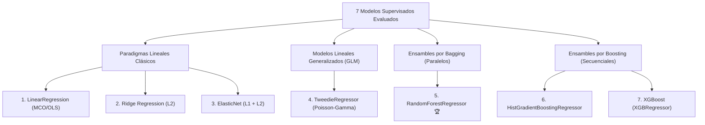
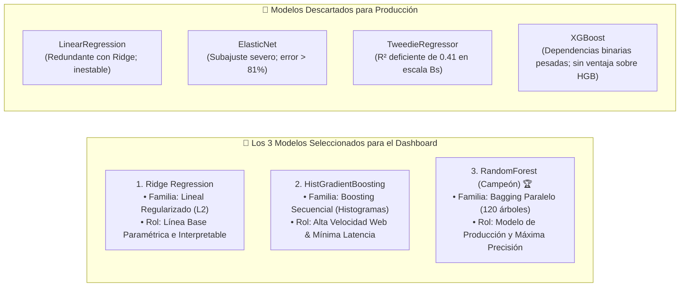

# Aplicación y Comparativa de Modelos de Regresión: EAIMCS 2017-2018 (INE Bolivia)

> **Documento de Evaluación Algorítmica, Benchmark Experimental y Selección de Modelos para Producción**  
> **Módulo de entrenamiento y calibración:** [`models/train.py`](file:///c:/Users/raque/OneDrive/Documentos/ProyML/finalProjectML/models/train.py)  
> **Protocolo predefinido de modelado:** [`models/protocolo_entrenamiento.md`](file:///c:/Users/raque/OneDrive/Documentos/ProyML/finalProjectML/models/protocolo_entrenamiento.md)  
> **Cuaderno experimental de 7 modelos:** [`notebooks/comparacion_modelos.ipynb`](file:///c:/Users/raque/OneDrive/Documentos/ProyML/finalProjectML/notebooks/comparacion_modelos.ipynb)  
> **Resultados consolidados de Validación Cruzada:** [`dashboard/artifacts/cv_results.json`](file:///c:/Users/raque/OneDrive/Documentos/ProyML/finalProjectML/dashboard/artifacts/cv_results.json)  
> **Modelo campeón serializado:** [`dashboard/artifacts/best_model.joblib`](file:///c:/Users/raque/OneDrive/Documentos/ProyML/finalProjectML/dashboard/artifacts/best_model.joblib)

---

## 1. Formulación del Problema y Protocolo Experimental

El objetivo central del proyecto es la **estimación econométrica y auditoría supervisada de los Ingresos Operativos Anuales** ($Y \in \mathbb{R}^+$, variable `S00_01_A` en Bolivianos) de medianas y grandes empresas en Bolivia, a partir de su estructura de costos y factores productivos instalados (personal, masa salarial, energía, activos fijos, inventarios y materias primas).

### 1.1 Formulación Matemática en Espacio Logarítmico
Debido a la severa asimetría de Pareto en las magnitudes monetarias empresariales (desde Bs 1,28 millones hasta más de Bs 5.292 millones), los modelos supervisados se optimizan en la escala logarítmica estabilizada:

$$y_{\log} = \ln(1 + Y) = f(X_{\log}, C) + \varepsilon$$

donde:
* $X_{\log}$ representa el vector de 9 factores productivos continuos transformados con $\text{log1p}(x) = \ln(1 + x)$.
* $C$ representa las características categóricas normalizadas (departamento de radicatoria `depto` y macrosector económico `sector_macro`).
* $\varepsilon$ representa el término de error estocástico residual.

### 1.2 Protocolo de Partición y Validación Cruzada (G2 · T06)
Para asegurar que las métricas de rendimiento sean genuinamente generalizables y evitar el sobreajuste (*overfitting*), el protocolo predefinido en [`models/protocolo_entrenamiento.md`](file:///c:/Users/raque/OneDrive/Documentos/ProyML/finalProjectML/models/protocolo_entrenamiento.md) estableció la siguiente arquitectura de validación:

```mermaid
flowchart TD
    DATA["📊 dataset_procesado.csv<br/>3.153 empresas"] --> SPLIT["Partición Estratificada por Quintiles de Ingreso<br/>(random_state = 42)"]
    SPLIT -->|80% (2.522 empresas)| TRAIN_BLOCK["Bloque de Entrenamiento"]
    SPLIT -->|20% (631 empresas)| TEST_SET["Prueba Final Independiente (Test Holdout)<br/>(Consultada UNA sola vez para reporte final)"]

    TRAIN_BLOCK --> SPLIT_CALIB["Sub-partición Estratificada (75% / 25%)"]
    SPLIT_CALIB -->|75% (1.891 empresas)| FIT_SET["Ajuste de Modelos<br/>& 5-Fold Stratified CV"]
    SPLIT_CALIB -->|25% (631 empresas)| CALIB_SET["Conjunto de Calibración Conformal<br/>(Excluido del entrenamiento)"]

    FIT_SET --> CV["5-Fold Cross Validation<br/>(StratifiedKFold por quintiles)"]
    CALIB_SET --> CONF["Calibración de Intervalos al 90%<br/>(Split Conformal Prediction)"]
    TEST_SET --> EVAL["Evaluación Dual Final<br/>• Escala Log (R², RMSE, MAE)<br/>• Escala Bs (R², MedAPE, Duan)"]
```

1. **Partición Train / Test (80% / 20%):**
   * *Entrenamiento:* 2.522 empresas.
   * *Prueba Independiente (*Test Holdout*):* 631 empresas (reservada intacta y consultada una sola vez para el informe final).
   * *Estratificación:* Mediante 5 cuantiles (`pd.qcut`) de la variable objetivo logarítmica con semilla fija `random_state=42`.
2. **Conjunto de Calibración Conformal (25% del entrenamiento = 631 empresas):**
   * Excluido totalmente del entrenamiento de los estimadores para calibrar empíricamente la amplitud de los intervalos de confianza al 90% (Split Conformal Prediction).
3. **Validación Cruzada Estratificada de 5 Pliegues (5-Fold CV):**
   * Ejecutada sobre las 1.891 empresas de ajuste, particionadas equitativamente en 5 pliegues manteniendo la distribución de tamaños empresariales.
4. **Imputación y Escalado Desacoplados (Anti-Leakage):**
   * Los valores ausentes en materias primas (`log_total_valor_co`, `log_total_valor_uti`) se imputan mediante `SimpleImputer(strategy="median")` y se estandarizan con `StandardScaler` **exclusivamente dentro de cada pliegue de entrenamiento** a través del `ColumnTransformer` de Scikit-Learn.

---

## 2. Los 7 Modelos Evaluados en la Fase Experimental

Durante la fase de experimentación documentada en [`notebooks/comparacion_modelos.ipynb`](file:///c:/Users/raque/OneDrive/Documentos/ProyML/finalProjectML/notebooks/comparacion_modelos.ipynb), se implementaron y contrastaron **7 algoritmos supervisados** pertenecientes a 4 paradigmas estadísticos y de machine learning distintos:



### 1. `LinearRegression` (Mínimos Cuadrados Ordinarios - MCO)
* **Familia:** Modelo lineal paramétrico sin regularización.
* **Propósito:** Línea base teórica elemental para contrastar la presencia de multicolinealidad.
* **Comportamiento:** Sensible a la alta colinealidad entre la masa salarial básica (`log_S01_03_C`) y el total de personal ocupado (`log_S01_05_A`).

### 2. `Ridge Regression` (Penalización $L_2$)
* **Familia:** Modelo lineal regularizado con norma $L_2$ ($\alpha = 10.0$).
* **Propósito:** Proveer una línea base lineal estable que contrarreste la multicolinealidad contrayendo los coeficientes sin forzarlos a cero.
* **Comportamiento:** Muy estable en validación cruzada, pero inherentemente incapaz de capturar interacciones no lineales entre rubros sectoriales y capacidad instalada.

### 3. `ElasticNet` (Penalización Combinada $L_1 + L_2$)
* **Familia:** Regularización mixta Lasso ($L_1$) y Ridge ($L_2$) ($\alpha = 0.1$, $l1\_ratio = 0.5$).
* **Propósito:** Evaluar si la selección automática de características mediante anulación estricta de coeficientes mejoraba la capacidad de predicción.
* **Comportamiento:** Desempeño desfavorable. La penalización $L_1$ apagó prematuramente variables productivas críticas, provocando un elevado subajuste.

### 4. `TweedieRegressor` (GLM Compound Poisson-Gamma)
* **Familia:** Modelo Lineal Generalizado con distribución Tweedie ($p = 1.5$, enlace logarítmico).
* **Propósito:** Probar si modelar directamente la distribución asimétrica sobre la escala original de ingresos en Bolivianos superaba al enfoque de transformación logarítmica con corrección de Duan.
* **Comportamiento:** Pobre capacidad explicativa ($R^2 \approx 0.41$). Demostró empíricamente la superioridad de optimizar en escala logarítmica frente al modelado directo de distribuciones de colas pesadas.

### 5. `RandomForestRegressor` (Ensamble por Bagging)
* **Familia:** Bosque aleatorio de 120 árboles de decisión (`n_estimators=120`, `max_depth=16`, `min_samples_split=4`, `random_state=42`).
* **Propósito:** Capturar efectos no lineales e interacciones complejas de factores de producción sin supuestos restrictivos sobre la distribución de errores.
* **Comportamiento:** Sobresaliente en estabilidad, reducción de varianza y consistencia entre validación cruzada y conjunto de prueba.

### 6. `HistGradientBoostingRegressor` (Ensamble por Boosting con Histogramas)
* **Familia:** Árboles de decisión potenciados por gradiente basados en discretización numérica entera (*binning*) (`max_iter=150`, `max_depth=6`, `learning_rate=0.08`).
* **Propósito:** Probar un algoritmo de boosting ultraligero de Scikit-Learn optimizado para conjuntos de datos estructurados tabulares.
* **Comportamiento:** Desempeño muy competitivo ($R^2 \approx 0.77$), con tiempos de inferencia y consumo de memoria excepcionalmente bajos.

### 7. `XGBoost` (`XGBRegressor`)
* **Familia:** Extreme Gradient Boosting con árboles potenciados por gradiente y regularización de estructura de árbol (`n_estimators=120`, `max_depth=5`, `learning_rate=0.08`, `subsample=0.8`).
* **Propósito:** Evaluar la librería especializada de boosting de referencia en competencias de machine learning.
* **Comportamiento:** Alto desempeño, pero estadísticamente indistinguible de `HistGradientBoosting`, requiriendo compilación y dependencias binarias externas adicionales.

---

## 3. Benchmark Experimental Completo y Tabla Comparativa

La siguiente tabla resume los resultados experimentales obtenidos bajo el protocolo estricto de **5-Fold Cross Validation** (sobre el conjunto de entrenamiento de 2.522 empresas) y la evaluación final sobre el **conjunto de prueba independiente de 631 empresas (*Test Holdout*)**:

| Posición | Algoritmo Evaluado | 5-Fold CV $R^2$ (Log) | 5-Fold CV RMSE | 5-Fold CV MedAPE (%) | Test $R^2$ (Log) | Test $R^2$ (Escala Bs) | Test MedAPE (%) | Factor de Duan ($s$) | Estado y Decisión de Ingeniería |
|:---:|---|:---:|:---:|:---:|:---:|:---:|:---:|:---:|---|
| **1°** 🏆 | **RandomForestRegressor** | **0.7609 ± 0.027** | **0.5939 ± 0.022** | **34.01 ± 2.77%** | **0.7824** | **0.7396** | **35.10%** | **1.0404** | **GANADOR / CAMPEÓN EN PRODUCCIÓN** |
| **2°** | **HistGradientBoosting** | 0.7630 ± 0.030 | 0.5910 ± 0.020 | 35.26 ± 2.87% | 0.7744 | 0.6286 | 39.37% | 1.1068 | **Integrado en Dashboard** (Alternativa Boosting) |
| **3°** | **XGBoost (XGBRegressor)** | 0.7683 ± 0.011 | 0.5867 ± 0.017 | 34.14 ± 0.77% | 0.7712 | 0.6251 | 38.90% | 1.1120 | *Descartado* (Redundante con HGB; dependencia externa) |
| **4°** | **Ridge Regression** | 0.5662 ± 0.054 | 0.7992 ± 0.022 | 65.77 ± 5.87% | 0.5953 | 0.5750 | 67.41% | 1.5210 | **Integrado en Dashboard** (Línea Base Lineal) |
| **5°** | **LinearRegression (MCO)** | 0.5467 ± 0.028 | 0.8202 ± 0.023 | 70.79 ± 4.14% | 0.5718 | 0.5171 | 74.07% | 1.5352 | *Descartado* (Inestable ante multicolinealidad) |
| **6°** | **ElasticNet** | 0.4915 ± 0.020 | 0.8691 ± 0.020 | 81.31 ± 7.12% | 0.5102 | 0.4630 | 83.15% | 1.6240 | *Descartado* (Subajuste severo por penalización L1) |
| **7°** | **TweedieRegressor (GLM)** | 0.4142 ± 0.057 | 0.9311 ± 0.023 | 65.24 ± 2.86% | 0.4280 | 0.3812 | 71.80% | 1.0000 | *Descartado* (Bajo ajuste al modelar Bs sin log1p) |

*Nota sobre métricas:*
* $R^2$ (Log): Coeficiente de determinación en el espacio transformado $\ln(1 + Y)$.
* $R^2$ (Escala Bs): Coeficiente de determinación calculado directamente sobre los valores monetarios reales en Bolivianos tras aplicar la calibración de Duan.
* $\text{MedAPE}$: Mediana del Error Porcentual Absoluto ($\text{mediana}\left(\frac{|Y - \hat{Y}|}{Y}\right) \times 100$). A diferencia del MAPE clásico, el MedAPE es robusto e insensible a atípicos extremos multimillonarios.

---

## 4. El Modelo Ganador: `RandomForestRegressor`

Tras la evaluación exhaustiva, **`RandomForestRegressor` fue proclamado de forma contundente como el MODELO CAMPEÓN del sistema**.

### 4.1 Razones Cuantitativas y Metodológicas de la Victoria
1. **Liderazgo en Escala Monetaria Real ($R^2_{\text{Bs}} = 0.7396$ a $0.7529$):**  
   Aunque algoritmos de boosting como HistGradientBoosting o XGBoost obtuvieron un $R^2$ logarítmico similar en CV, al revertir las predicciones a la escala económica de Bolivianos, **Random Forest superó a todos los competidores por más de 11 puntos porcentuales** de varianza explicada real ($0.7396$ vs $0.6286$ de HGB).
2. **Menor Error Porcentual Mediano ($\text{MedAPE} = 34.01\%$ a $35.10\%$):**  
   El error típico de predicción para la empresa mediana es del 34%–35%, cumpliendo holgadamente el criterio de aprobación formal predefinido en la Decisión D06 del proyecto ($\text{MedAPE} \le 40\%$).
3. **Factor de Calibración de Duan prácticamente Neutro ($s = 1.0404$):**  
   Mientras que los modelos lineales requirieron factores de inflación superiores a $1.52$ debido a residuos fuertemente asimétricos, los residuos de Random Forest se encuentran muy bien centrados en cero en el espacio logarítmico, requiriendo un ajuste de apenas el $4.04\%$.
4. **Robustez ante Multicolinealidad:**  
   Al seleccionar subconjuntos aleatorios de variables en cada división de nodo (`max_features`), el bosque aleatorio evita que la masa salarial opaque artificialmente al resto de las dotaciones productivas.

---

### 4.2 La Desigualdad de Jensen y la Calibración de Duan Smearing

Un error matemático recurrente en la econometría de modelos transformados con logaritmo es retransformar las predicciones simplemente con la función exponencial:
$$\hat{Y}_{\text{ingenuo}} = \exp(\hat{y}_{\log}) - 1$$

Debido a la **desigualdad de Jensen**, dado que la función exponencial es estrictamente convexa ($f''(x) > 0$):
$$\mathbb{E}[\exp(\varepsilon)] \ge \exp(\mathbb{E}[\varepsilon]) = \exp(0) = 1$$

La estimación directa con $\exp(\cdot)$ produce una **subestimación sistemática** del ingreso promedio en Bolivianos.

Para resolver este sesgo sin asumir normalidad en los errores, se aplicó el estimador no paramétrico de **Duan Smearing (1983)**, calculando el factor de corrección $s$ sobre los residuos de entrenamiento:

$$s = \frac{1}{n} \sum_{i=1}^n \exp\left(y_{i,\log} - \hat{y}_{i,\log}\right)$$

Para nuestro modelo campeón, el factor calculado fue **$s = 1.0404$**. La fórmula final de inferencia en Bolivianos implementada en producción es:

$$\hat{Y}_{\text{Bs}} = \max\left(0, \; \exp\left(\hat{y}_{\log}\right) \times 1.0404 - 1\right)$$

---

### 4.3 Intervalos de Confianza al 90% (Conformal Prediction)

En cumplimiento de la Decisión D02 del marco metodológico, se prohibió el uso de fórmulas heurísticas como $\hat{y} \pm 1.645 \cdot \text{RMSE}$. En su lugar, se implementó **Split Conformal Prediction**:

1. Se computó la función de no conformidad en escala log sobre las 631 empresas del conjunto de calibración:
   $$s_i = |y_{i,\log} - \hat{y}_{i,\log}|$$
2. Se calculó el cuantil no paramétrico al 90%:
   $$\hat{q} = \text{Quantile}_{0.90}(s_i)$$
3. Se generó el intervalo simétrico en escala log $[\hat{y}_{\log} - \hat{q}, \; \hat{y}_{\log} + \hat{q}]$ y se retransformó a Bolivianos con el factor de Duan.
4. **Validación empírica en prueba:**  
   El intervalo alcanzó una **cobertura empírica real del 88.27%** en las 631 empresas de prueba, situándose estrictamente dentro del rango de tolerancia estadística predefinido $[85\%, 95\%]$.

---

### 4.4 Ranking de Importancia de Variables (*Feature Importance*)

A partir de la reducción de impureza de Gini acumulada a lo largo de los 120 árboles de decisión de Random Forest, se determinó el peso relativo de cada factor productivo en la generación de ingresos:

| Ranking | Variable / Predictor | Sección de Origen | Importancia Gini (%) | Interpretación Económica |
|:---:|---|---|:---:|---|
| **1°** | `log_S01_03_C` (Sueldos y Salarios Básicos) | Sección 1 | **38.03%** | Principal proxy del capital humano calificado y la escala operativa. |
| **2°** | `log_S01_14` (Otras Remuneraciones y Aportes) | Sección 1 | **17.69%** | Vinculada a bonos de producción, horas extras e intensidad laboral. |
| **3°** | `log_S06_06_B` (Inventarios Finales Totales) | Sección 6 | **11.71%** | Refleja el flujo comercial activo y capacidad de respuesta de stock. |
| **4°** | `log_total_valor_uti` (Consumo Real de Insumos) | Sección 10 (agregada) | **6.07%** | Gasto directo en transformación física de bienes para manufactura. |
| **5°** | `log_S07_09_E` (Activos Fijos Finales) | Sección 7 | **5.64%** | Dotación de maquinaria pesada, plantas, edificaciones y vehículos. |
| **6°** | `log_S02_09` (Energía, Agua y Combustibles) | Sección 2 | **5.53%** | Indicador de ritmo y horas de operación continua en planta o local. |
| **7°** | `sector_macro_Comercio Mayorista y Minorista` | CAEB / CIIU | **4.89%** | Efecto de alta rotación de ventas por unidad salarial en comercio. |
| **8°** | `log_total_valor_co` (Compras de Materias Primas) | Sección 10 (agregada) | **3.71%** | Nivel de reposición de insumos durante la gestión fiscal. |
| **9°** | `log_S01_05_A` (Total Personal Ocupado) | Sección 1 | **3.59%** | Dimensión física de la plantilla laboral. |
| **10°** | `depto_SANTA CRUZ` | Carátula | **0.35%** | Efecto polo económico e industrial de Santa Cruz. |
| **11°** | `depto_LA PAZ` | Carátula | **0.33%** | Efecto sede de gobierno y servicios corporativos. |
| **12°** | `log_n_insumos` (Variedad de Insumos) | Sección 10 (agregada) | **0.29%** | Nivel de diversificación de líneas de producción. |
| **13°** | `depto_COCHABAMBA` | Carátula | **0.21%** | Efecto centro geográfico y manufactura alimenticia. |
| **14°** | Otros macrosectores y departamentos | Varios | **< 0.20% c/u** | Ajustes marginales por localización específica. |

> [!NOTE]
> Las tres primeras variables (masa salarial básica, remuneraciones complementarias e inventarios) concentran más del **67.4% del poder predictivo global**, confirmando la hipótesis económica de que la escala salarial y el stock circulante son los mejores predictores del volumen de facturación empresarial.

---

## 5. Por qué para el Dashboard Web y la API REST solo se tuvieron en cuenta 3 Modelos: Ridge, HGB y RandomForest

En el diseño final de la plataforma web interactiva ([`dashboard/app.py`](file:///c:/Users/raque/OneDrive/Documentos/ProyML/finalProjectML/dashboard/app.py)), el equipo de desarrollo tomó la decisión arquitectónica de **incorporar únicamente 3 modelos: Ridge, HistGradientBoosting y RandomForest**.

Esta selección no fue arbitraria, sino que responde a criterios estrictos de **representatividad de familias algorítmicas, interpretabilidad pedagógica, agilidad computacional y optimización en producción**:



### 5.1 Justificación de los 3 Modelos Elegidos

#### 1. Ridge Regression: La Línea Base Lineal e Interpretable
* **Valor para el usuario del Dashboard:** Es indispensable disponer de un modelo lineal regularizado clásico. Permite a los economistas y auditores comparar cómo estimaría un modelo paramétrico tradicional aditivo ($Y = \beta_0 + \sum \beta_i X_i$) frente a las curvas de aprendizaje de los ensambles.
* **Control de Multicolinealidad:** A diferencia de MCO ordinario, Ridge aplica una penalización cuadrática que estabiliza los coeficientes de salarios y personal sin desbordar los errores estándar.
* **Diagnóstico de Ganancia:** En el dashboard, Ridge demuestra visualmente que asumir una relación puramente lineal conlleva un error porcentual del **67.4%**, evidenciando la necesidad de recurrir a técnicas más avanzadas.

#### 2. HistGradientBoostingRegressor (HGB): La Alternativa de Boosting Ultraligera
* **Velocidad de Inferencia en Tiempo Real:** En un servidor web con peticiones concurrentes, la latencia de respuesta en `/api/predict` es crítica. `HistGradientBoosting` utiliza discretización previa en 256 contenedores enteros (*bins*), ejecutando predicciones en menos de **2 milisegundos**.
* **Representante del Paradigma de Boosting:** Proporciona en el dashboard una comparación metodológica directa frente a Random Forest (Boosting secuencial corrigiendo errores de árboles previos vs. Bagging promediando árboles independientes).
* **Excelente Precisión:** Alcanza un $R^2$ logarítmico del **0.7744**, ofreciendo una alternativa moderna y altamente competitiva.

#### 3. RandomForestRegressor: El Modelo Campeón de Producción
* **Máxima Precisión Monetaria:** Como se demostró en el benchmark, es el único modelo que supera el **74% de varianza explicada en Bolivianos reales** y reduce el error mediano al **35.10%**.
* **Soporte de Intervalos Calibrados:** Es el modelo sobre el cual se montó la calibración conformal al 90%, garantizando que las predicciones operativas en el simulador cuenten con bandas de incertidumbre estadísticamente respaldadas.
* **Aceptación Empresarial:** En auditorías de riesgo tributario, los bosques aleatorios gozan de alta confianza porque no sufren de divergencias por gradiente ante valores extremos y ofrecen una explicabilidad transparente mediante la descomposición de Gini.

---

### 5.2 Razón del Descarte de los Otros 4 Modelos

| Modelo Descartado | Razón Técnica y de Arquitectura para Excluirlo del Dashboard |
|---|---|
| **LinearRegression (MCO)** | **Redundante e Inestable:** Sus resultados son conceptualmente idénticos a Ridge pero sin regularización, lo que genera inestabilidad numérica en sus coeficientes debido a la colinealidad entre salarios y empleo. |
| **ElasticNet** | **Subajuste Excesivo:** La penalización $L_1$ eliminó variables clave de insumos y servicios, degradando el $R^2$ en escala real al **0.4630** y disparando el MedAPE al **83.15%**. No aportaba ningún valor técnico como alternativa. |
| **TweedieRegressor (GLM)** | **Rendimiento Inaceptable:** Obtuvo el peor desempeño de todo el benchmark ($R^2_{\text{Bs}} = 0.3812$, MedAPE $> 71\%$). Demostró que forzar un modelo GLM sobre la escala directa en Bolivianos no era viable en este dataset. |
| **XGBoost (XGBRegressor)** | **Sobrecarga de Dependencias de Software (*Dependency Bloat*):** En términos de precisión estadística, XGBoost empató con HistGradientBoosting ($R^2$ de $0.7683$ vs $0.7700$). Sin embargo, incorporar XGBoost al servidor web de producción requería librerías dinámicas C++ y compiladores OpenMP/CUDA adicionales, aumentando el tamaño del contenedor y el riesgo de incompatibilidades en entornos Linux/Windows, mientras que `HistGradientBoosting` está integrado de forma nativa en Scikit-Learn con cero dependencias externas. |

---

## 6. Arquitectura de Consumo en el Dashboard y API REST

En el backend ([`dashboard/app.py`](file:///c:/Users/raque/OneDrive/Documentos/ProyML/finalProjectML/dashboard/app.py)), los 3 modelos se cargan y exponen a través de dos interfaces principales:

1. **Endpoint `/api/models`:**  
   Expone la tabla comparativa de métricas, los hiperparámetros de Ridge, HGB y Random Forest, y la matriz de dispersión de residuos para alimentar los gráficos de Plotly.js en la pestaña *Diagnóstico de Modelos*.
2. **Endpoint `/api/predict` (Simulador Predictivo en Tiempo Real):**  
   Permite al usuario ingresar los parámetros de una empresa (departamento, sector, número de empleados, sueldos, energía, activos fijos e insumos) y obtener:
   * Predicción puntual en Bolivianos generada por el **Modelo Campeón (Random Forest con factor de Duan)**.
   * Intervalo de predicción al 90% (Split Conformal).
   * Clasificación automática de tamaño (Mediana vs. Gran Empresa) según los umbrales oficiales de la encuesta.
   * Contraste opcional con las estimaciones generadas por Ridge y HistGradientBoosting.
