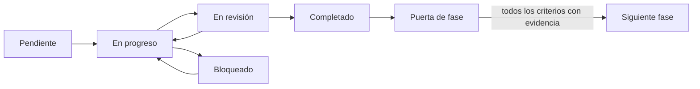

# Implementación del dashboard EAIMCS

Estado del plan: **en ejecución**. Fecha de línea base: 2026-09-28. Consultar `seguimiento.csv` para el estado real de cada fase; un documento o artefacto existente no acredita por sí solo que el producto cumpla sus criterios.

## Lectura y fuente de verdad

1. [Auditoría de la documentación existente](00_auditoria_docs.md): qué conservar y qué corregir.
2. [Plan maestro y cambios por archivo](01_plan_maestro.md): secuencia, responsables funcionales y entregables.
3. [Contratos y arquitectura](02_contratos_y_arquitectura.md): datos, modelos, API y trazabilidad.
4. [Diseño de gráficos](03_diseno_graficos.md): especificaciones de cada vista.
5. [Matriz de aceptación](04_matriz_aceptacion.md): objetivos y condiciones de salida.
6. [Plan de pruebas](05_plan_pruebas.md): cómo demostrar cada condición.
7. [Decisiones y riesgos](06_decisiones_y_riesgos.md): asuntos abiertos y mitigaciones.
8. [Fuentes y línea base](07_fuentes_y_linea_base.md): hechos observados frente a fuentes externas.

El [seguimiento.csv](seguimiento.csv) es la fuente única del estado de las tareas. La matriz define qué significa aprobar cada control. Los informes y capturas futuros se guardan en [evidencias](evidencias/README.md). Ninguna tarea empieza como completada.

El [inventario de columnas](inventario_columnas.csv) distingue campos oficiales del extracto y derivados locales. Su clasificación de predictores es preliminar hasta la auditoría de fuga de G2.

## Flujo de control



Para pasar una tarea a `completado`: cumplir sus IDs de aceptación, depositar evidencia reproducible y sin datos individuales sensibles, registrar ruta, revisor y fecha en `seguimiento.csv`; verificar que todas las dependencias estén completas. Si falla una comprobación, devolverla a `en_progreso`. Una puerta G0–G5 se aprueba solo cuando están completas todas sus tareas y sus criterios de aceptación. El porcentaje de avance es tareas completadas / tareas totales; nunca sustituye el resultado de las puertas.

Ejecutar desde la raíz del repositorio:

```powershell
./scripts/verificar_plan.ps1
./scripts/verificar_plan.ps1 -RequireComplete
```

El primer comando valida estructura, dependencias, revisión y evidencias, e informa avance. El segundo retorna código distinto de cero hasta que todas las puertas estén aprobadas. Toda ejecución posterior debe actualizar el CSV y el registro de decisiones; la documentación heredada se corrige en G0, antes de tomarla como especificación vigente.
