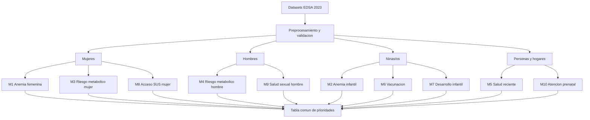

# Fundamentos de Machine Learning aplicados al proyecto EDSA 2023

## 1. Proposito del documento

Este documento justifica, desde la teoria de Machine Learning y desde la estructura real de los datasets EDSA 2023, que tipo de aprendizaje se debe utilizar, que modelos son adecuados, como debe prepararse la informacion y como se debe evaluar el resultado.

El objetivo del proyecto no es reemplazar un diagnostico clinico. El objetivo es construir herramientas de **priorizacion y apoyo a la gestion sanitaria** que identifiquen personas o grupos que deberian recibir medicion, seguimiento, orientacion o confirmacion profesional.

La salida de cada modelo debe interpretarse como una probabilidad o nivel de prioridad, no como una sentencia medica.

## 2. Decision principal: aprendizaje supervisado

### 2.1 Que es

En el aprendizaje supervisado se dispone de:

- Variables de entrada o caracteristicas, llamadas `X`.
- Una variable objetivo o etiqueta, llamada `y`.
- Observaciones donde el resultado ya fue registrado.

El algoritmo aprende una funcion aproximada:

$$
f: X \rightarrow y
$$

En este proyecto, ejemplos de etiquetas existentes son:

- `tip_anemia_m`: anemia en mujeres.
- `tip_anemia`: anemia en ninas/os.
- `categaimc_m`: categoria de IMC en mujeres.
- `categaimc_h`: categoria de IMC en hombres.
- `idit`: indice de desarrollo infantil.
- `hs03_0033`: problema de salud reciente en personas del hogar.
- `ms05_0506` y `ms05_0507`: registro y atencion por el SUS.

Como existen resultados observados, el proyecto tiene las condiciones para aplicar aprendizaje supervisado.

### 2.2 Por que es el enfoque adecuado

El aprendizaje supervisado permite:

1. Entrenar con resultados de salud ya observados.
2. Estimar la probabilidad de que otra persona presente un resultado semejante.
3. Clasificar casos en prioridad alta, media o baja.
4. Evaluar objetivamente el rendimiento con datos no utilizados durante el entrenamiento.
5. Medir errores de deteccion y falsas alarmas.
6. Explicar que variables contribuyen a la priorizacion.

Por ejemplo, para anemia femenina se define:

$$
y_{anemia} =
\begin{cases}
1, & \text{anemia leve, moderada o severa}\\
0, & \text{sin anemia}
\end{cases}
$$

El modelo aprende con caracteristicas como edad, educacion, area, region, embarazo, seguro, condiciones de vivienda y acceso a salud, pero no debe recibir como entrada la misma hemoglobina o la categoria que se intenta predecir.

## 3. Tipo de problema para cada modelo

| Modelo | Objetivo | Tipo de aprendizaje supervisado | Justificacion |
|---|---|---|---|
| M1 | Anemia en mujeres | Clasificacion binaria o multiclase | Se puede predecir anemia/no anemia o leve/moderada/severa. |
| M2 | Anemia infantil | Clasificacion binaria o multiclase | El resultado `tip_anemia` ya esta registrado. |
| M3 | Sobrepeso/obesidad en mujeres | Clasificacion binaria o multiclase | `categaimc_m` contiene categorias observadas. |
| M4 | Sobrepeso/obesidad en hombres | Clasificacion binaria o multiclase | `categaimc_h` contiene categorias observadas. |
| M5 | Problema de salud reciente | Clasificacion binaria | `hs03_0033` permite separar si/no. |
| M6 | Vacunacion infantil | Clasificacion binaria o multiclase | Se puede definir esquema completo/incompleto/desconocido. |
| M7 | Desarrollo infantil | Clasificacion binaria | `idit` diferencia hitos alcanzados y no alcanzados. |
| M8 | Acceso al SUS en mujeres | Clasificacion binaria | Registro y atencion se modelan como objetivos separados. |
| M9 | Salud sexual masculina | Clasificacion binaria | Uso de condon o acceso a servicios puede definirse como si/no. |
| M10 | Atencion prenatal | Clasificacion binaria, multiclase o regresion | Se puede modelar atencion suficiente, tipo de atencion o numero de controles. |

### 3.1 Clasificacion binaria

Es la primera opcion para los objetivos de priorizacion:

- Anemia: si/no.
- Sobrepeso u obesidad: si/no.
- Vacunacion incompleta: si/no.
- Hitos del desarrollo no alcanzados: si/no.
- Registro en SUS: si/no.
- Atencion prenatal insuficiente: si/no.

La salida principal sera una probabilidad:

$$
P(y=1 \mid X)
$$

Esa probabilidad se puede transformar en prioridad utilizando umbrales definidos por la capacidad del sistema de salud.

### 3.2 Clasificacion multiclase

Debe utilizarse cuando las categorias tienen significado propio:

- Sin anemia, leve, moderada y severa.
- Normal, delgadez y sobrepeso/obesidad.
- Bueno, regular y malo, si se usa una variable de calidad de atencion.

No se debe aplicar una codificacion numerica que suponga automaticamente que la distancia entre categorias es igual. En anemia existe un orden clinico, pero aun asi conviene comparar modelos ordinales y multiclase antes de decidir.

### 3.3 Regresion

Se utiliza cuando el resultado es numerico continuo o de conteo:

- Numero de controles prenatales.
- Numero de hijos.
- Edad.
- Tiempo hasta una atencion, si estuviera disponible.

No se debe convertir innecesariamente un conteo en una categoria, porque se pierde informacion. Para conteos pueden evaluarse regresion Poisson o modelos de conteo, siempre que la distribucion y los supuestos sean adecuados.

## 4. Modelos recomendados

### 4.1 Modelo base: regresion logistica

La regresion logistica debe ser el modelo inicial para M1-M9 cuando el objetivo sea binario.

Su forma general es:

$$
P(y=1 \mid X)=\frac{1}{1+e^{-(\beta_0+\beta_1x_1+\cdots+\beta_px_p)}}
$$

Se recomienda como linea base porque:

- Produce probabilidades.
- Es interpretable.
- Permite analizar el signo y magnitud de los coeficientes.
- Funciona bien con variables categoricas codificadas.
- Permite regularizacion L1 o L2.
- Es adecuada cuando se necesita justificar una priorizacion ante personal no tecnico.

Para variables de alta dimensionalidad se puede usar regularizacion:

- L1: ayuda a seleccionar variables y producir modelos mas dispersos.
- L2: estabiliza coeficientes correlacionados.
- Elastic Net: combina ambas estrategias.

La regresion logistica no demuestra causalidad. Un coeficiente positivo indica asociacion con la probabilidad estimada, no que la variable cause el resultado.

### 4.2 Arbol de decision

Debe usarse como segundo modelo de referencia.

Ventajas:

- Genera reglas faciles de leer.
- Representa interacciones y relaciones no lineales.
- Puede mostrar cortes por edad, area o condiciones de vivienda.
- Es util para explicar perfiles de riesgo.

Riesgo principal:

- Puede sobreajustarse si crece demasiado.

Se deben controlar profundidad, minimo de observaciones por hoja y complejidad del arbol.

### 4.3 Random Forest

Es recomendable como modelo comparativo para M1-M7 porque:

- Combina muchos arboles.
- Reduce la inestabilidad de un solo arbol.
- Detecta relaciones no lineales.
- Puede capturar interacciones entre factores sociales y clinicos.

Debe evaluarse con validacion cruzada y no interpretarse unicamente mediante importancia tradicional de variables. Es preferible complementar con importancia por permutacion o explicaciones locales.

### 4.4 Gradient Boosting

Puede utilizarse cuando se busque mayor capacidad predictiva:

- XGBoost.
- LightGBM.
- HistGradientBoosting.

Es especialmente util cuando existen relaciones complejas, pero requiere mayor cuidado con:

- Sobreajuste.
- Hiperparametros.
- Calibracion.
- Interpretabilidad.
- Valores faltantes y categorias.

No debe elegirse automaticamente por ser mas sofisticado. Primero debe superar de manera consistente a la regresion logistica y al arbol base.

### 4.5 Modelos no supervisados

El aprendizaje no supervisado no predice directamente anemia o vacunacion, porque no utiliza una etiqueta objetivo. Puede utilizarse como complemento para:

- Descubrir perfiles de vulnerabilidad.
- Agrupar hogares con condiciones semejantes.
- Identificar patrones de acceso a salud.
- Explorar combinaciones de nutricion, vivienda y territorio.
- Detectar observaciones atipicas.

Metodos posibles:

- K-means para perfiles numericos y codificados.
- Clustering jerarquico para explorar relaciones entre grupos.
- DBSCAN para grupos y observaciones atipicas.
- PCA para visualizar y reducir dimensionalidad.

El resultado de un cluster no es una enfermedad ni una etiqueta clinica. Un grupo encontrado debe ser descrito y posteriormente validado por especialistas.

### 4.6 Aprendizaje por refuerzo

No se recomienda para este proyecto.

El aprendizaje por refuerzo requiere:

- Un agente.
- Un entorno.
- Estados.
- Acciones.
- Recompensas o penalizaciones.
- Interacciones repetidas.
- Una politica que se actualiza con la experiencia.

La EDSA 2023 es principalmente una encuesta observacional transversal. Contiene respuestas y mediciones, pero no registra una secuencia de decisiones del sistema de salud con recompensas y resultados posteriores suficientes para entrenar un agente.

Por tanto, utilizar aprendizaje por refuerzo seria teoricamente inadecuado y metodologicamente dificil de justificar.

## 5. Arquitectura recomendada del proyecto

No se debe construir un solo modelo general con todas las personas. Se recomienda una arquitectura de modelos especializados:

Cada modelo debe tener:

- Poblacion definida.
- Unidad de observacion definida.
- Variable objetivo documentada.
- Ponderador identificado.
- Variables predictoras autorizadas.
- Pipeline propio.
- Metricas propias.
- Reporte de errores por subgrupo.

## 6. Preprocesamiento teoricamente correcto

### 6.1 Principio de separacion entre datos y objetivo

El dataset debe dividirse conceptualmente en:

- `X`: variables predictoras.
- `y`: variable objetivo.
- Metadatos: identificadores, ponderadores y claves de auditoria.

Los identificadores no deben entrar en `X`. Los ponderadores no son una caracteristica clinica; se utilizan para estimaciones poblacionales o, cuando corresponda, como peso de observacion, pero no deben confundirse con predictores.

### 6.2 Fuga de informacion

Existe fuga de informacion cuando una variable de `X` contiene directa o indirectamente el resultado que el modelo intenta anticipar.

Ejemplos en este proyecto:

- Usar `hs06_0120` para predecir `tip_anemia_m`.
- Usar `hs06_0127` para predecir `tip_anemia`.
- Usar `imc_m` para predecir `categaimc_m`.
- Usar peso y talla para priorizar a una persona antes de medirla.
- Usar `tip_anemia_m` como predictor de anemia.
- Usar respuestas posteriores a un evento para anticipar ese mismo evento.

La fuga produce metricas artificialmente altas y un modelo que fallara cuando se use con casos nuevos.

### 6.3 Valores faltantes

En las encuestas, los faltantes no son todos iguales:

- No aplica por salto.
- No sabe.
- No responde.
- No medido.
- Error de captura.

La imputacion debe ajustarse unicamente con train. Nunca se debe calcular la mediana, moda o cualquier estadistico usando todo el dataset antes de separar los datos.

Reglas recomendadas:

- Numericas: mediana de train.
- Categoricas: categoria `DESCONOCIDO` o moda de train.
- Faltantes estructurales: categoria `NO APLICA` si contiene informacion del universo.
- Objetivo: no imputar; excluir o definir el universo valido.

### 6.4 Codificacion

- One-Hot Encoding para departamento, region, material, tipo de vivienda y otras categorias sin orden.
- Codificacion ordinal solo para variables con orden defendible, como quintil de riqueza.
- Variables binarias como 0/1.
- Respuestas multiples como varios indicadores independientes.
- No aplicar Label Encoding a categorias nominales, porque crearia un orden falso.

### 6.5 Escalado

Para regresion logistica, SVM, KNN y redes neuronales:

- Usar `StandardScaler` cuando sea apropiado.
- Ajustar el escalador solo con train.

Para arboles y ensambles de arboles, el escalado no es esencial, aunque la limpieza y codificacion siguen siendo necesarias.

### 6.6 Seleccion de variables

La seleccion debe hacerse despues de dividir los datos y dentro de la validacion. Se deben eliminar:

- Identificadores.
- Variables constantes.
- Variables duplicadas.
- Variables con fuga.
- Variables posteriores al resultado.
- Variables no disponibles en el momento de la priorizacion.

La regularizacion L1, la importancia por permutacion y la seleccion basada en train son opciones teoricamente justificables.

## 7. Division de datos y validacion

### 7.1 Train, validation y test

Una division inicial puede ser:

- 70% train.
- 15% validation.
- 15% test.

Tambien puede utilizarse validacion cruzada estratificada dentro de train y reservar un test final.

La regla fundamental es:

> Primero se divide; despues se imputa, codifica, escala y seleccionan variables.

### 7.2 Evitar dependencia entre filas

Las tablas de esta encuesta contienen personas del mismo hogar y multiples eventos de una misma mujer. Si observaciones relacionadas aparecen en train y test, el modelo puede aprender caracteristicas del mismo hogar o persona y producir una evaluacion demasiado optimista.

Se debe dividir por:

- Persona, cuando el modelo es individual.
- Hogar, cuando se utilizan variables del hogar.
- Mujer, cuando se agregan historiales reproductivos.
- Evento, solo cuando el objetivo realmente es por evento y se controla la dependencia.

### 7.3 Validacion territorial

Ademas de la validacion aleatoria, se recomienda una prueba territorial:

- Entrenar con algunos departamentos.
- Probar con departamentos no vistos.

Esto permite evaluar si el modelo generaliza fuera de los territorios observados durante el entrenamiento.

## 8. Evaluacion teorica y practica

### 8.1 Clasificacion binaria

No se debe evaluar un modelo solamente con accuracy, especialmente si las clases estan desbalanceadas.

Metricas recomendadas:

- Sensibilidad o recall: proporción de positivos reales detectados.
- Especificidad: proporción de negativos reales correctamente descartados.
- Precision: proporción de alertas que realmente corresponden a casos positivos.
- F1: equilibrio entre precision y recall.
- AUC-ROC.
- AUC-PR para clases desbalanceadas.
- Matriz de confusion.
- Curva de calibracion.

En priorizacion sanitaria, la sensibilidad suele ser especialmente importante porque un falso negativo puede significar que una persona con riesgo no reciba seguimiento.

### 8.2 Clasificacion multiclase

Utilizar:

- Macro-F1.
- Balanced accuracy.
- Recall por clase.
- Matriz de confusion.

No basta con que el modelo acierte las clases mas frecuentes. Debe revisarse el rendimiento en anemia moderada y severa, si existen suficientes observaciones.

### 8.3 Regresion

Para numero de controles, numero de hijos u otros resultados numericos:

- MAE.
- RMSE.
- R2.
- Analisis de residuos.

### 8.4 Equidad y subgrupos

Reportar metricas por:

- Area urbana/rural.
- Region.
- Departamento.
- Sexo.
- Grupo de edad.
- Quintil de riqueza.
- Calidad de vivienda.

Un AUC general aceptable puede ocultar un rendimiento deficiente en poblaciones rurales o en ninas/os.

## 9. Ponderadores de encuesta

Los ponderadores deben utilizarse de forma coherente con el objetivo del analisis.

Ponderadores relevantes:

- Mujeres: `ponderadorm`.
- Hemoglobina femenina: `ponderador_mhm`.
- Hemoglobina infantil: `ponderador_nhm`.
- Peso y talla femenina: `ponderador_mpt`.
- Peso y talla masculina: `ponderador_vpt`.
- Primera infancia: `ponderador`.
- Vivienda/hogar: `ponderadorhviv`.

Para estadisticas descriptivas poblacionales se deben utilizar ponderadores, estrato y UPM de acuerdo con el diseno de encuesta.

Para Machine Learning predictivo se debe documentar si el ponderador se utiliza como:

1. Peso de observacion durante el ajuste.
2. Elemento para construir metricas ponderadas.
3. Elemento reservado solo para estimacion poblacional.

No se debe introducir el ponderador como una caracteristica predictora, porque representa el diseno muestral y no una propiedad de salud de la persona.

## 10. Fundamento de la eleccion final

La eleccion recomendada para este proyecto es:

1. **Aprendizaje supervisado** como enfoque principal.
2. **Regresion logistica** como linea base interpretable.
3. **Arbol de decision** como modelo explicable alternativo.
4. **Random Forest o Gradient Boosting** como comparacion no lineal.
5. **Clustering/PCA** solo como exploracion complementaria.
6. **No usar aprendizaje por refuerzo** por falta de interacciones secuenciales y recompensas.

Esta combinacion es adecuada porque equilibra:

- Fundamento estadistico.
- Interpretabilidad.
- Capacidad predictiva.
- Control de sesgos.
- Compatibilidad con los datasets disponibles.
- Posibilidad de justificar las decisiones ante un contexto sanitario.

No se debe elegir el modelo por ser el mas complejo. Se debe elegir el modelo que, despues de validacion, ofrezca el mejor equilibrio entre rendimiento, calibracion, equidad, interpretabilidad y posibilidad de uso real.

## 11. Conclusion

Los datasets EDSA 2023 permiten desarrollar aprendizaje supervisado porque contienen variables objetivo observadas para anemia, IMC, desarrollo, vacunacion, problemas de salud y acceso.

La estrategia correcta no es construir un modelo unico para todos los pacientes. La estrategia correcta es construir modelos especializados por poblacion y objetivo, con un preprocesamiento reproducible y un conjunto comun de resultados de prioridad.

El orden metodologico debe ser:

1. Definir poblacion y objetivo.
2. Seleccionar el dataset principal.
3. Validar unidad de observacion y claves.
4. Integrar fuentes auxiliares.
5. Separar train, validation y test.
6. Ajustar imputacion, codificacion y escalado solo con train.
7. Entrenar regresion logistica como base.
8. Comparar con arboles y ensambles.
9. Evaluar rendimiento, calibracion y equidad.
10. Documentar limitaciones.
11. Generar prioridades para seguimiento humano.

El resultado debe ser una herramienta de apoyo a decisiones y no un diagnostico automatico.
